欢迎来到教程的第四部分！ 中途！ 希望事情开始感觉很舒服 

But don't get too comfortable 我们正在走向新的领域，需要一些大脑的充分理解。 在接下来的两部分教程中，我们将深入到Gatsby数据层！ Gatsby的一个强大功能，可让您轻松地从Markdown，Wordpress，无头CMS和其他所有类型的数据源构建网站。

## 本教程前半部分的总结

到目前为止，我们一直在学习如何使用React.js--能够创建自己的组件以充当网站的自定义构建块的能力如何。

我们还使用CSS-in-JS探索了样式组件，这使我们可以在组件中封装CSS。

## 数据在Gatsby

一个网站有四个部分，HTML，CSS，JS和数据。 本教程的前半部分集中在前三个部分。 现在我们来学习如何在Gatsby网站中使用数据。

什么是数据？

一个非常计算机科学的答案是：数据就像“字符串”，整数（42），对象（{pizza：true}）等等

然而，为了在Gatsby工作，更有用的答案是“React组件之外的所有东西”。

到目前为止，我们一直在编写文本，并直接在组件中添加图像。 这是建立多个网站的绝佳方式。 但是，通常要将数据存储在组件之外，然后根据需要将数据导入组件。

例如，如果您使用Wordpress构建网站（所以其他贡献者具有良好的添加和维护内容的界面）和Gatsby，则网站（网页和帖子）的数据在Wordpress中，并根据需要将数据提取到 你的组件。

数据也可以生活在像Markdown，CSV等文件类型，以及各种数据库和API。

Gatsby的数据层让我们可以将数据从这些（以及其他来源）中直接导入到我们的组件中 - 以我们想要的形式。

## Gatsby的数据层如何使用GraphQL将数据提取到组件中.

如果你对React世界很熟悉，有许多选项可以将数据加载到组件中。 其中最流行和最健壮的是一种名为GraphQL的技术。

GraphQL是在Facebook发明的，以帮助产品工程师将所需的数据提取到组件中。

GraphQL是一种查询语言（它的名字的QL部分）。 如果您熟悉SQL，它的工作方式非常类似。 您可以在组件中使用特殊的语法描述所需的数据，然后将数据提供给您。

Gatsby使用GraphQL让组件声明它需要的数据，然后将这些数据提供给组件。

## 我们的第一个GraphQL查询

让我们为本教程的这一部分创建另一个新的网站，就像前面的部分一样。 我们打算建立一个简单的Markdown博客, 名字叫“大熊猫吃很多”。 这是专门展示熊猫吃大量食物的最佳图片和视频。 随着我们对GraphQL的深入了解和Gatsby对Markdown的支持。

```shell
gatsby new tutorial-part-four https://github.com/gatsbyjs/gatsby-starter-hello-world
```

然后安装一些其他需要的依赖项。 我们将使用字体主题Kirkham +我们将尝试另一个CSS-in-JS库Glamorous。

```shell
npm install --save gatsby-plugin-typography gatsby-plugin-glamor glamorous typography-theme-kirkham
```

让我们设置一个类似于我们上次用布局组件和两个页面组件结束的站点。

`src/pages/index.js`

```jsx
import React from "react"

export default () =>
  <div>
    <h1>Amazing Pandas Eating Things</h1>
    <div>
      
    </div>
  </div>
```

`src/pages/about.js`

```jsx
import React from "react"

export default () =>
  <div>
    <h1>About Pandas Eating Lots</h1>
    <p>
      We're the only site running on your computer dedicated to showing the best
      photos and videos of pandas eating lots of food.
    </p>
  </div>
```

`src/layouts/index.js`

```jsx
import React from "react"
import g from "glamorous"
import { css } from "glamor"
import Link from "gatsby-link"

import { rhythm } from "../utils/typography"

const linkStyle = css({ float: `right` })

export default ({ children }) =>
  <g.Div
    margin={`0 auto`}
    maxWidth={700}
    padding={rhythm(2)}
    paddingTop={rhythm(1.5)}
  >
    <Link to={`/`}>
      <g.H3
        marginBottom={rhythm(2)}
        display={`inline-block`}
        fontStyle={`normal`}
      >
        Pandas Eating Lots
      </g.H3>
    </Link>
    <Link className={linkStyle} to={`/about/`}>
      About
    </Link>
    {children()}
  </g.Div>
```

`src/utils/typography.js`

```javascript
import Typography from "typography"
import kirkhamTheme from "typography-theme-kirkham"

const typography = new Typography(kirkhamTheme)

module.exports = typography
```

gatsby-config.js（必须在你的项目的根目录下，而不是在src下）

```javascript
module.exports = {
  plugins: [
    `gatsby-plugin-glamor`,
    {
      resolve: `gatsby-plugin-typography`,
      options: {
        pathToConfigModule: `src/utils/typography`,
      },
    },
  ],
}
```

添加上面的文件，然后运行gatsby develop，你应该看到以下内容：

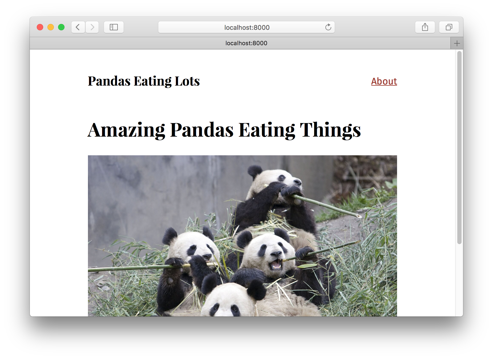

我们有另一个布局和两个页面简单的网站。

Now let's start querying 

在构建站点时，通常要重复使用站点中常见的数据位。 像网站标题例如。 看看/about/页面。 您会注意到我们在布局组件（站点标题）以及关于页面的标题中都有站点标题。 但是如果我们想在未来的某个时候改变网站的标题呢？ 我们必须使用网站标题搜索我们所有的组件。 这既麻烦又容易出错，尤其是在网站变得更大，更复杂的情况下。 将标题存储在一个地方，然后在需要的时候把这个标题放到组件中会更好。

为了解决这个问题，盖茨比支持添加网站“元数据”的简单模式，比如标题。

我们将这些数据添加到gatsby-config.js文件中。 让我们将我们的网站标题添加到gatsby-config.js，然后从我们的布局和关于页面查询它！

编辑你的gatsby-config.js：

```javascript{2-4}
module.exports = {
  siteMetadata: {
    title: `Blah Blah Fake Title`,
  },
  plugins: [
    `gatsby-plugin-glamor`,
    {
      resolve: `gatsby-plugin-typography`,
      options: {
        pathToConfigModule: `src/utils/typography`,
      },
    },
  ],
}
```

重新启动开发服务器。

然后编辑这两个组件：

`src/pages/about.js`

```jsx{3,5-7,14-23}
import React from "react"

export default ({ data }) =>
  <div>
    <h1>
      About {data.site.siteMetadata.title}
    </h1>
    <p>
      We're the only site running on your computer dedicated to showing the best
      photos and videos of pandas eating lots of food.
    </p>
  </div>

export const query = graphql`
  query AboutQuery {
    site {
      siteMetadata {
        title
      }
    }
  }
`
```

`src/layouts/index.js`

```jsx{10,19,28-33}
import React from "react"
import g from "glamorous"
import { css } from "glamor"
import Link from "gatsby-link"

import { rhythm } from "../utils/typography"

const linkStyle = css({ float: `right` })

export default ({ children, data }) =>
  <g.Div
    margin={`0 auto`}
    maxWidth={700}
    padding={rhythm(2)}
    paddingTop={rhythm(1.5)}
  >
    <Link to={`/`}>
      <g.H3 marginBottom={rhythm(2)} display={`inline-block`}>
        {data.site.siteMetadata.title}
      </g.H3>
    </Link>
    <Link className={linkStyle} to={`/about/`}>
      About
    </Link>
    {children()}
  </g.Div>

export const query = graphql`
  query LayoutQuery {
    site {
      siteMetadata {
        title
      }
    }
  }
`
```

好了！！！ 

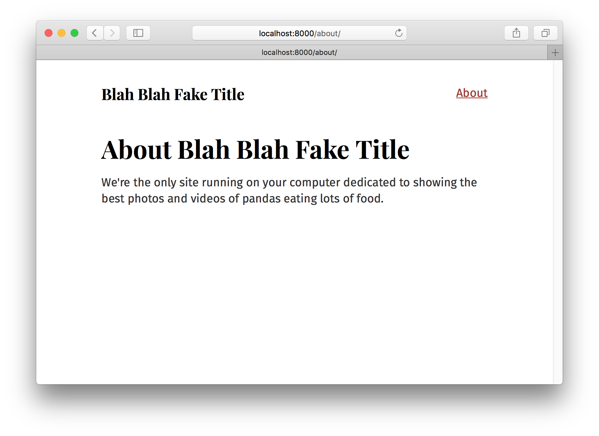

But let's restore the real title.

Gatsby的核心原则之一是创造者需要立即联系他们正在创造的东西（帽子提示给布雷特·维克多）。 换句话说，当你对代码进行修改时，你应该立即看到这个改变的效果。 你操纵Gatsby的输入，你看到在屏幕上显示新的输出。

所以几乎在任何地方，你所做的改变都会立即生效。

尝试在siteMetadata中编辑标题 - 将标题改回“大熊猫吃很多”。 浏览器中的变化应该会很快显示出来。

## 介绍GraphiQL

GraphiQL是GraphQL IDE。 这是一个在构建Gatsby网站时经常使用的功能强大的（全能的）工具。

您可以在网站的开发服务器正常运行时访问它（通常位于http://localhost:8000/___ graphql）。

<video controls="controls" autoplay="true" loop="true">
  <source type="video/mp4" src="/graphiql-explore.mp4"></source>
  <p>Your browser does not support the video element.</p>
</video>

在这里，我们围绕内置的Site“type”进行探究，看看有哪些可用的字段，包括我们之前查询过的siteMetadata对象。 尝试打开GraphiQL并显示你的数据！ 按Ctrl +空格键弹出自动填充窗口，按Ctrl + Enter键运行查询。 本教程的其余部分将更多地使用GraphiQL。

## 源插件

Gatsby网站的数据可以来自任何地方：API，数据库，CMS，本地文件等。

源插件从他们的源获取数据。 例如。 文件系统源插件知道如何从文件系统中获取数据。 Wordpress插件知道如何从Wordpress API获取数据。

让我们添加gatsby-source-filesystem并探索它是如何工作的。

首先安装插件：

```sh
npm install --save gatsby-source-filesystem
```

然后把它添加到你的gatsby-config.js中：

```javascript{6-12}
module.exports = {
  siteMetadata: {
    title: `Pandas Eating Lots`,
  },
  plugins: [
    {
      resolve: `gatsby-source-filesystem`,
      options: {
        name: `src`,
        path: `${__dirname}/src/`,
      },
    },
    `gatsby-plugin-glamor`,
    {
      resolve: `gatsby-plugin-typography`,
      options: {
        pathToConfigModule: `src/utils/typography`,
      },
    },
  ],
}
```

保存并重新启动gatsby开发服务器。 然后再次打开GraphiQL。

如果你弹出自动填充窗口，你会看到：

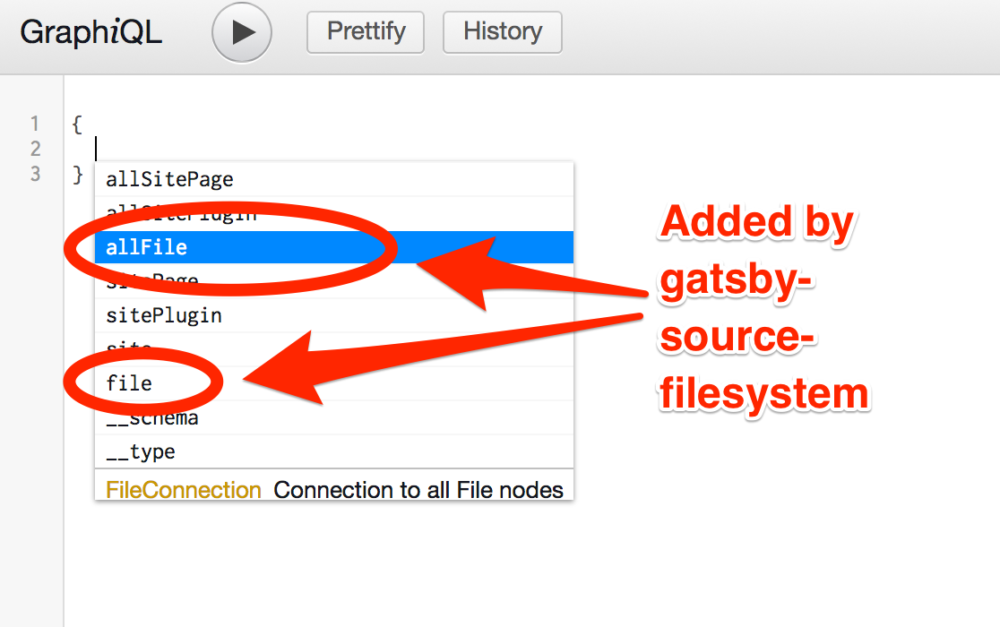

在allFile上输入Enter，然后按Ctrl + Enter运行查询。

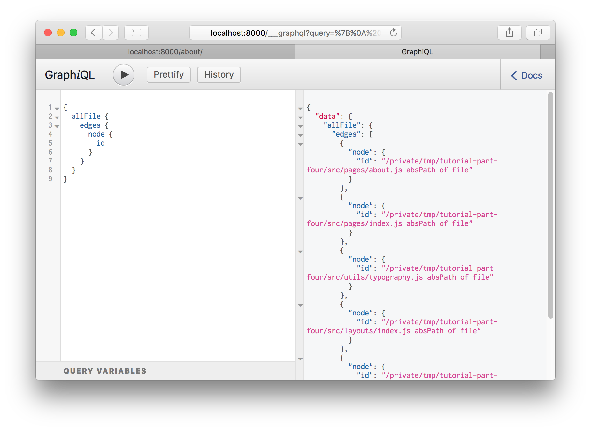

从查询中删除标识并重新启动自动完成（Ctrl +空格键）。

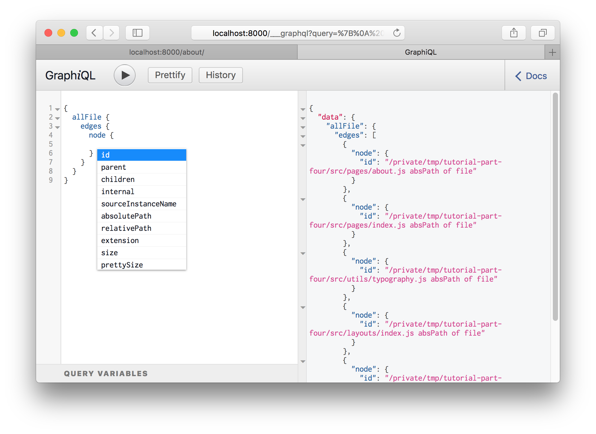

尝试添加一些字段到您的查询，每次按Ctrl + Enter重新运行查询。 你会看到这样的东西：

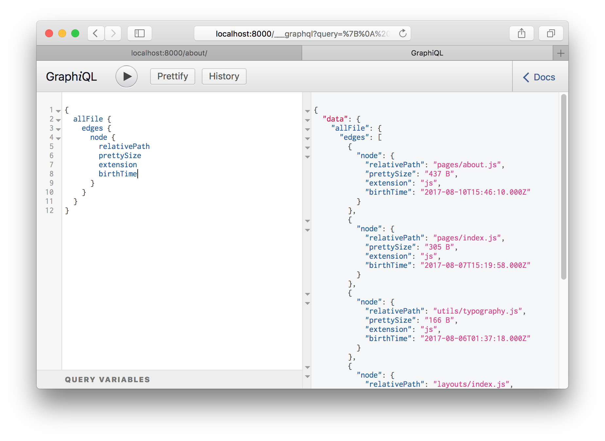

他的结果是一个文件“节点”的数组（节点是“图”中的对象的花式名称）。 每个File对象都有我们查询的字段。

## 使用GraphQL查询构建一个页面

用Gatsby构建新页面通常从GraphiQL开始。 您首先通过在GraphiQL中播放查看数据查询，然后将其复制到React页面组件以开始构建UI。

我们来试试这个。

使用我们刚创建的allFile查询在src/pages/my-files.js创建一个新文件。

```jsx{4}
import React from "react"

export default ({ data }) => {
  console.log(data)
  return <div>Hello world</div>
}

export const query = graphql`
  query MyFilesQuery {
    allFile {
      edges {
        node {
          relativePath
          prettySize
          extension
          birthTime(fromNow: true)
        }
      }
    }
  }
`
```

Console.log（数据）行在上面突出显示。 创建一个新组件来控制从查询中获取的数据通常会很有帮助，这样您就可以在构建UI时浏览浏览器控制台中的数据。

如果您访问/ my-files /中的新页面并打开浏览器控制台，您将看到：

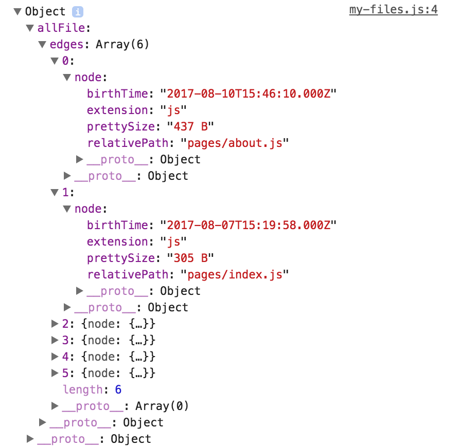

数据的形状与查询的形状相匹配。

让我们添加一些代码到我们的组件打印出文件数据。

```jsx{5-37}
import React from "react"

export default ({ data }) => {
  console.log(data)
  return (
    <div>
      <h1>My Site's Files</h1>
      <table>
        <thead>
          <tr>
            <th>relativePath</th>
            <th>prettySize</th>
            <th>extension</th>
            <th>birthTime</th>
          </tr>
        </thead>
        <tbody>
          {data.allFile.edges.map(({ node }, index) =>
            <tr key={index}>
              <td>
                {node.relativePath}
              </td>
              <td>
                {node.prettySize}
              </td>
              <td>
                {node.extension}
              </td>
              <td>
                {node.birthTime}
              </td>
            </tr>
          )}
        </tbody>
      </table>
    </div>
  )
}

export const query = graphql`
  query MyFilesQuery {
    allFile {
      edges {
        node {
          relativePath
          prettySize
          extension
          birthTime(fromNow: true)
        }
      }
    }
  }
`
```

然后... 

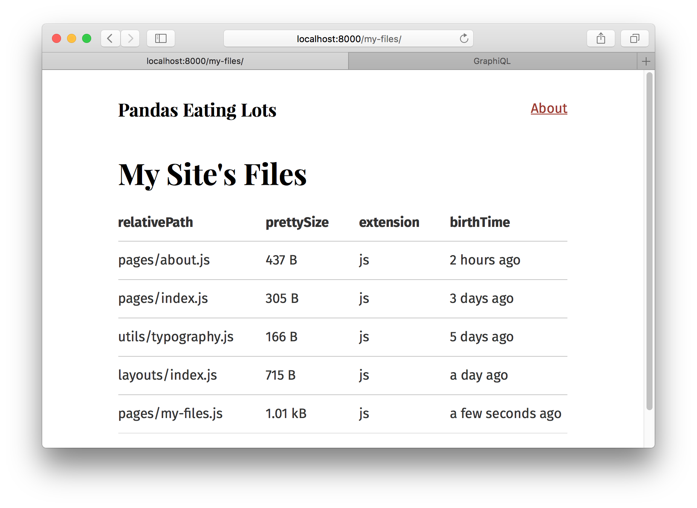

## Transformer 插件

通常，我们从源码插件获得的数据格式并不是您想要用来构建您的网站的格式。 文件系统源插件可以让你查询有关文件的数据，但是如果你想查询文件中的数据呢？

为了做到这一点，Gatsby支持从源插件获取原始内容的变压器插件，并将其转换为更加实用的东西。

例如，Markdown文件。 Markdown很好写，但是当你用它建立一个页面时，你需要把markdown变成HTML。

让我们在src/ pages/sweet-pandas-eating-sweets.md（这将成为我们的第一个markdown博客文章）中添加一个降价文件到我们的网站，并学习如何使用transformer 插件和GraphQL将其转换为HTML。

```markdown
---
title: "Sweet Pandas Eating Sweets"
date: "2017-08-10"
---

Pandas are really sweet.

这是熊猫吃甜食的视频。

<iframe width="560" height="315" src="https://www.youtube.com/embed/4n0xNbfJLR8" frameborder="0" allowfullscreen></iframe>
```

一旦保存了文件，再次查看/my-files/新的Markdown文件在表格中。 这是Gatsby非常强大的特点。 像之前的siteMetadata示例一样，源插件可以重新加载数据。 gatsby-source-filesystem总是扫描新文件，并在它们出现时重新运行查询。

让我们添加一个可以转换Markdown文件的transformer(转换器) 插件。

```shell
npm install --save gatsby-transformer-remark
```

然后像正常一样将它添加到gatsby-config.js中。

```javascript{13}
module.exports = {
  siteMetadata: {
    title: `Pandas Eating Lots`,
  },
  plugins: [
    {
      resolve: `gatsby-source-filesystem`,
      options: {
        name: `src`,
        path: `${__dirname}/src/`,
      },
    },
    `gatsby-transformer-remark`,
    `gatsby-plugin-glamor`,
    {
      resolve: `gatsby-plugin-typography`,
      options: {
        pathToConfigModule: `src/utils/typography`,
      },
    },
  ],
}
```

重新启动开发服务器，然后刷新（或再次打开）GraphiQL并查看自动完成：

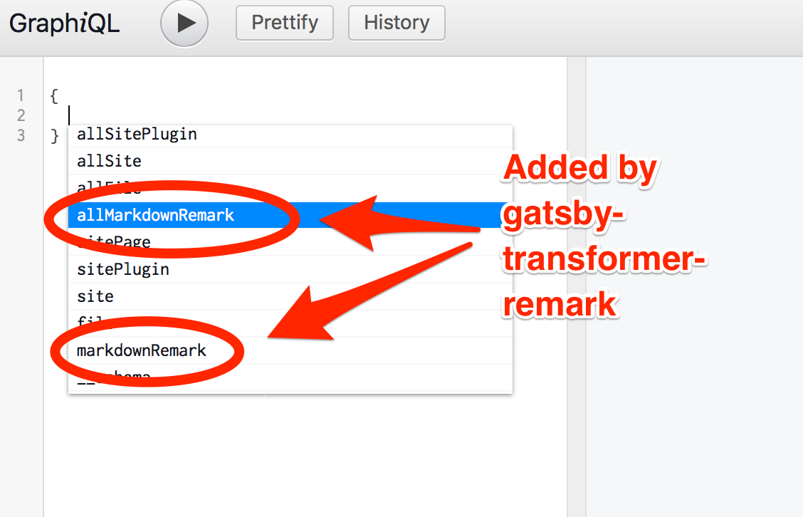

再次选择allMarkdownRemark并像我们为allFile一样运行它。 你会看到我们最近添加的Markdown文件。 浏览MarkdownRemark节点上可用的字段。

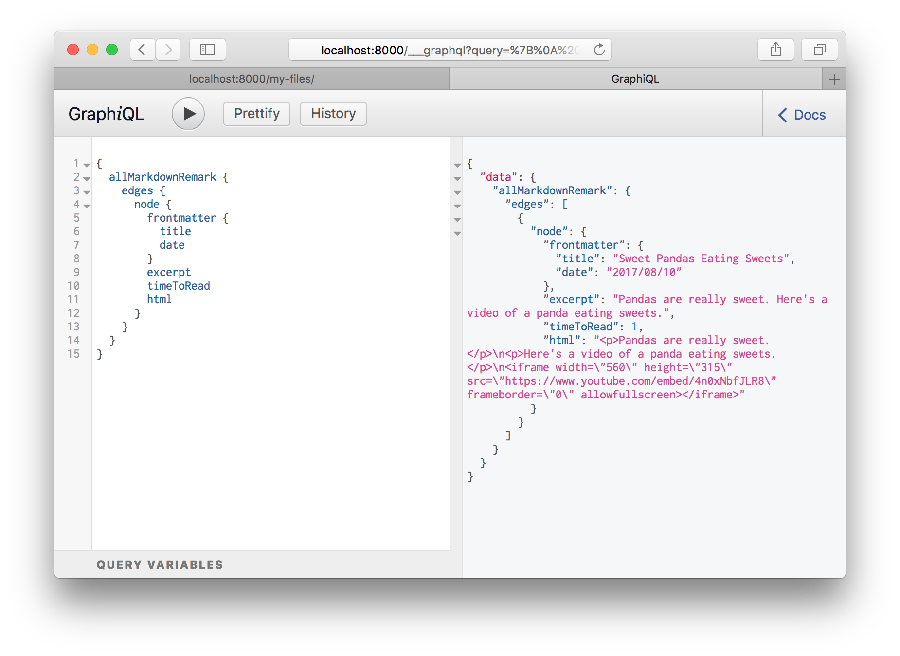

好了， 希望一些基础知识开始落实到位。 源代码插件将数据带入到Gatsby的数据系统中，变压器插件转换源插件带来的原始内容。 这个简单的模式可以处理您在构建Gatsby网站时可能需要的所有数据采购和数据转换。

## 在src/pages/index.js中创建我们网站的Markdown文件列表

现在让我们在头版上创建一个我们的Markdown文件列表。 像许多博客一样，我们希望最终在首页上指向每篇博文的链接列表。 使用GraphQL，我们可以查询当前的降价博客文章列表，所以我们不需要手动维护列表。

与src/pages/my-files.js页面一样，将src/pages/index.js替换为以下内容以添加具有一些初始HTML和样式的查询。

```jsx
import React from "react"
import g from "glamorous"

import { rhythm } from "../utils/typography"

export default ({ data }) => {
  console.log(data)
  return (
    <div>
      <g.H1 display={"inline-block"} borderBottom={"1px solid"}>
        Amazing Pandas Eating Things
      </g.H1>
      <h4>
        {data.allMarkdownRemark.totalCount} Posts
      </h4>
      {data.allMarkdownRemark.edges.map(({ node }) =>
        <div key={node.id}>
          <g.H3 marginBottom={rhythm(1 / 4)}>
            {node.frontmatter.title}{" "}
            <g.Span color="#BBB">— {node.frontmatter.date}</g.Span>
          </g.H3>
          <p>
            {node.excerpt}
          </p>
        </div>
      )}
    </div>
  )
}

export const query = graphql`
  query IndexQuery {
    allMarkdownRemark {
      totalCount
      edges {
        node {
          id
          frontmatter {
            title
            date(formatString: "DD MMMM, YYYY")
          }
          excerpt
        }
      }
    }
  }
`
```

现在，首页应该是这样的：

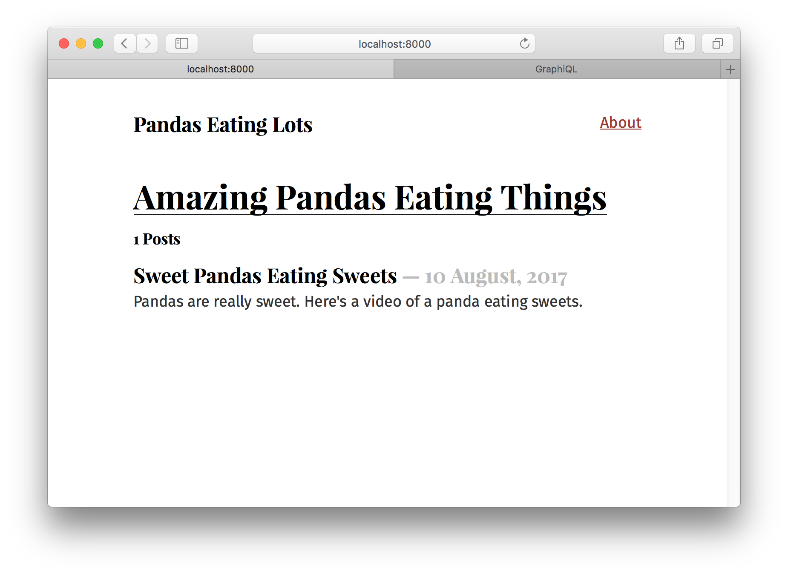

但是我们的一篇博文看起来有点孤单。 所以让我们在src/pages/pandas-and-bananas.md上再添加一个

```markdown
---
title: Pandas and Bananas
date: "2017-08-21"
---

Do Pandas eat bananas? Check out this short video that shows that yes! pandas do seem to really enjoy bananas!

<iframe width="560" height="315" src="https://www.youtube.com/embed/4SZl1r2O_bY" frameborder="0" allowfullscreen></iframe>
```

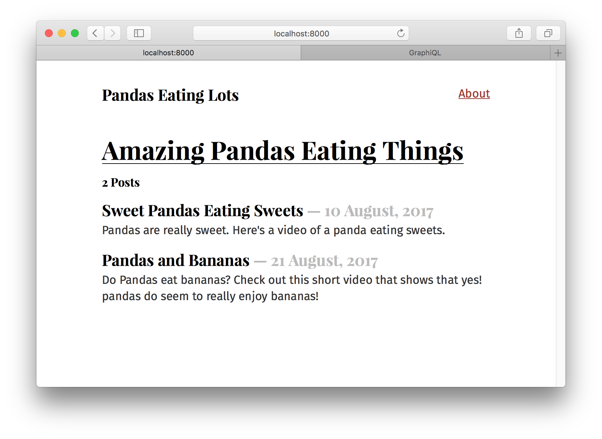

这看起来不错！ 除了... 帖子的顺序是错的。

但这很容易解决。 查询某种类型的连接时，可以将各种参数传递给查询。 您可以对节点进行排序和过滤，设置要跳过的节点数量，并选择要检索的节点数量限制。 有了这套功能强大的运算符，我们可以根据需要的格式选择我们想要的任何数据。

在我们的索引页的查询中，将allMarkdownRemark改为allMarkdownRemark（sort：{fields：[frontmatter___date]，order：DESC}）。 保存这个，排序顺序应该是固定的。

尝试打开GraphiQL并使用不同的排序选项。 您可以将allFile连接与其他连接一起排序。

## 以编程方式从数据创建页面

所以这太棒了！ 我们有一个很好的索引页，我们正在查询我们的降价文件。 但我们不想看到摘录，我们希望我们的降价文件的实际页面。

让我们开始吧。

到目前为止，我们已经通过在src/pages中放置React组件来创建页面。 现在我们将学习如何以编程方式从数据创建页面。 Gatsby并不局限于像许多静态站点生成器一样从文件中创建页面。 Gatsby允许您使用GraphQL来查询数据并将数据映射到页面 - 所有这些都是在构建时完成的。 This is a really powerful idea. We'll be exploring its implications and ways to use it for the remainder of the tutorial.

Creating new pages has two steps, 1) generate the "path" or "slug" for the page and 2) create the page.

To create our markdown pages, we'll learn to use two Gatsby APIs [`onCreateNode`](/docs/node-apis/#onCreateNode) and [`createPages`](/docs/node-apis/#createPages). These are two workhorse APIs you'll see used in many sites and plugins.

APIs are simple to implement. To implement an API, you simply export a function with the name of the API from `gatsby-node.js`.

So let's do that. In the root of your site, create a file named `gatsby-node.js`. Then add to it the following. This function will be called by Gatsby whenever a new node is created (or updated).

```javascript
exports.onCreateNode = ({ node }) => {
  console.log(node.internal.type)
}
```

Stop and restart the development server. As you do, you'll see quite a few newly created nodes get logged to the terminal console.

Let's use this API to add the slugs for our markdown pages to `MarkdownRemark` nodes.

Change our function so it now is only looking at `MarkdownRemark` nodes.

```javascript{2-4}
exports.onCreateNode = ({ node }) => {
  if (node.internal.type === `MarkdownRemark`) {
    console.log(node.internal.type)
  }
}
```

We want to use each markdown file name to create the page slug. So `pandas-and-bananas.md"` will become `/pandas-and-bananas/`. But how do we get the file name from the `MarkdownRemark` node? To get it, we need to *traverse* the "node graph" to its *parent* `File` node, as `File` nodes contain data we need about files on disk. To do that, modify our function again:

```javascript{1,3-4}
exports.onCreateNode = ({ node, getNode }) => {
  if (node.internal.type === `MarkdownRemark`) {
    const fileNode = getNode(node.parent)
    console.log(`\n`, fileNode.relativePath)
  }
}
```

There in your terminal you should see the relative paths for our two markdown files.

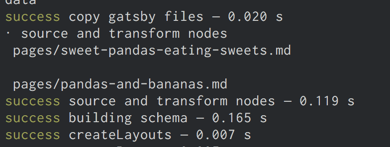

Now let's create slugs. As the logic for creating slugs from file names can get tricky, the `gatsby-source-filesystem` plugin ships with a function for creating slugs. Let's use that.

```javascript{1,5}
const { createFilePath } = require(`gatsby-source-filesystem`)

exports.onCreateNode = ({ node, getNode }) => {
  if (node.internal.type === `MarkdownRemark`) {
    console.log(createFilePath({ node, getNode, basePath: `pages` }))
  }
}
```

The function handles finding the parent `File` node along with creating the slug. Run the development server again and you should see logged to the terminal two slugs, one for each markdown file.

Now lets add our new slugs directly onto the `MarkdownRemark` nodes. This is powerful, as any data we add to nodes is available to query later with GraphQL. So it'll be easy to get the slug when it comes time to create the pages.

To do so, we'll use a function passed to our API implementation called [`createNodeField`](/docs/bound-action-creators/#createNodeField). This function allows us to create additional fields on nodes created by other plugins. Only the original creator of a node can directly modify the node—all other plugins (including our `gatsby-node.js`) must use this function to create additional fields.

```javascript{3,4,6-11}
const { createFilePath } = require(`gatsby-source-filesystem`)

exports.onCreateNode = ({ node, getNode, boundActionCreators }) => {
  const { createNodeField } = boundActionCreators
  if (node.internal.type === `MarkdownRemark`) {
    const slug = createFilePath({ node, getNode, basePath: `pages` })
    createNodeField({
      node,
      name: `slug`,
      value: slug,
    })
  }
}
```

Restart the development server and open or refresh Graph*i*QL. Then run this query to see our new slugs.

```graphql
{
  allMarkdownRemark {
    edges {
      node {
        fields {
          slug
        }
      }
    }
  }
}
```

Now that the slugs are created, we can create the pages.

In the same `gatsby-node.js` file, add the following. Here we tell Gatsby about our pages—what are their paths, what template component do they use, etc.

```javascript{15-35}
const { createFilePath } = require(`gatsby-source-filesystem`)

exports.onCreateNode = ({ node, getNode, boundActionCreators }) => {
  const { createNodeField } = boundActionCreators
  if (node.internal.type === `MarkdownRemark`) {
    const slug = createFilePath({ node, getNode, basePath: `pages` })
    createNodeField({
      node,
      name: `slug`,
      value: slug,
    })
  }
}

exports.createPages = ({ graphql, boundActionCreators }) => {
  const { createPage } = boundActionCreators
  return new Promise((resolve, reject) => {
    graphql(`
      {
        allMarkdownRemark {
          edges {
            node {
              fields {
                slug
              }
            }
          }
        }
      }
    `).then(result => {
      console.log(JSON.stringify(result, null, 4))
      resolve()
    })
  })
}
```

We've added an implementation of the [`createPages`](/docs/node-apis/#createPages) API which Gatsby calls to add pages. We're using the passed in `graphql` function to query for the markdown slugs we just created. Then we're logging out the result of the query which should look like:

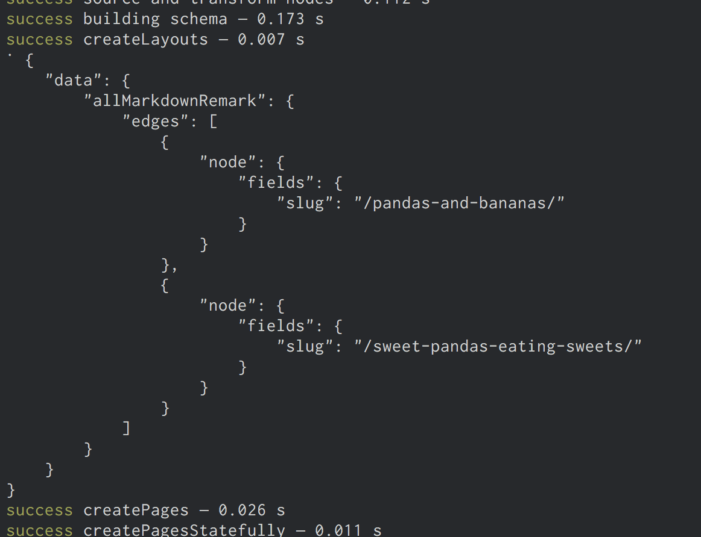

We need one other thing to create pages: a page template component. Like everything in Gatsby, programmatic pages are powered by React components. When creating a page, we need to specify which component to use.

Create a directory at `src/templates` and then add the following in a file named `src/templates/blog-post.js`.

```jsx
import React from "react"

export default () => {
  return <div>Hello blog post</div>
}
```

Then update `gatsby-node.js`

```javascript{1,32-41}
const path = require(`path`)
const { createFilePath } = require(`gatsby-source-filesystem`)

exports.onCreateNode = ({ node, getNode, boundActionCreators }) => {
  const { createNodeField } = boundActionCreators
  if (node.internal.type === `MarkdownRemark`) {
    const slug = createFilePath({ node, getNode, basePath: `pages` })
    createNodeField({
      node,
      name: `slug`,
      value: slug,
    })
  }
}

exports.createPages = ({ graphql, boundActionCreators }) => {
  const { createPage } = boundActionCreators
  return new Promise((resolve, reject) => {
    graphql(`
      {
        allMarkdownRemark {
          edges {
            node {
              fields {
                slug
              }
            }
          }
        }
      }
    `).then(result => {
      result.data.allMarkdownRemark.edges.map(({ node }) => {
        createPage({
          path: node.fields.slug,
          component: path.resolve(`./src/templates/blog-post.js`),
          context: {
            // Data passed to context is available in page queries as GraphQL variables.
            slug: node.fields.slug,
          },
        })
      })
      resolve()
    })
  })
}
```

Restart the development server and our pages will be created! An easy way to find new pages you create while developing is to go to a random path where Gatsby will helpfully show you a list of pages on the site. If you go to <http://localhost:8000/sdf> you'll see the new pages we created.

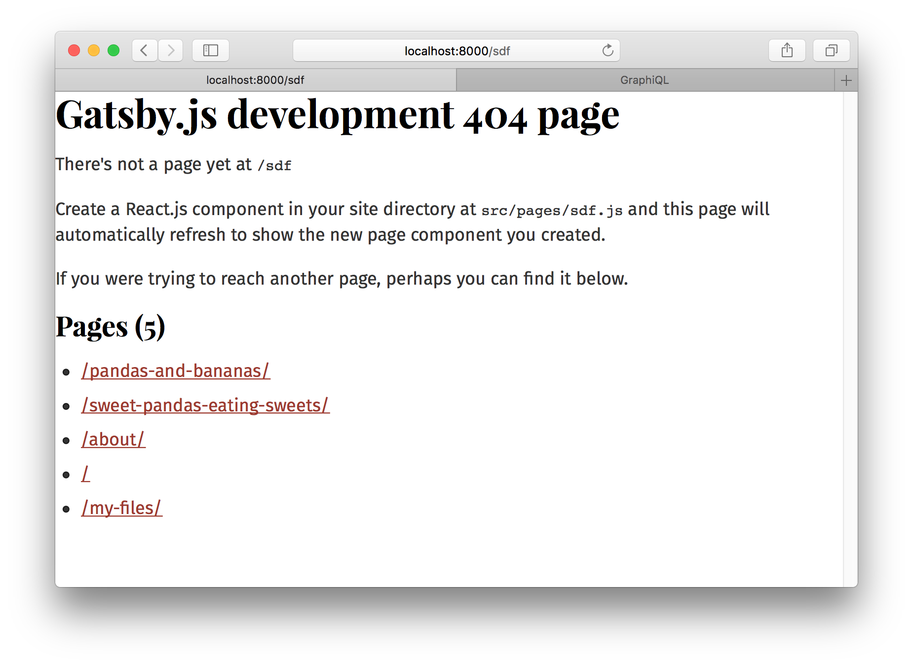

Visit one of them and we see:

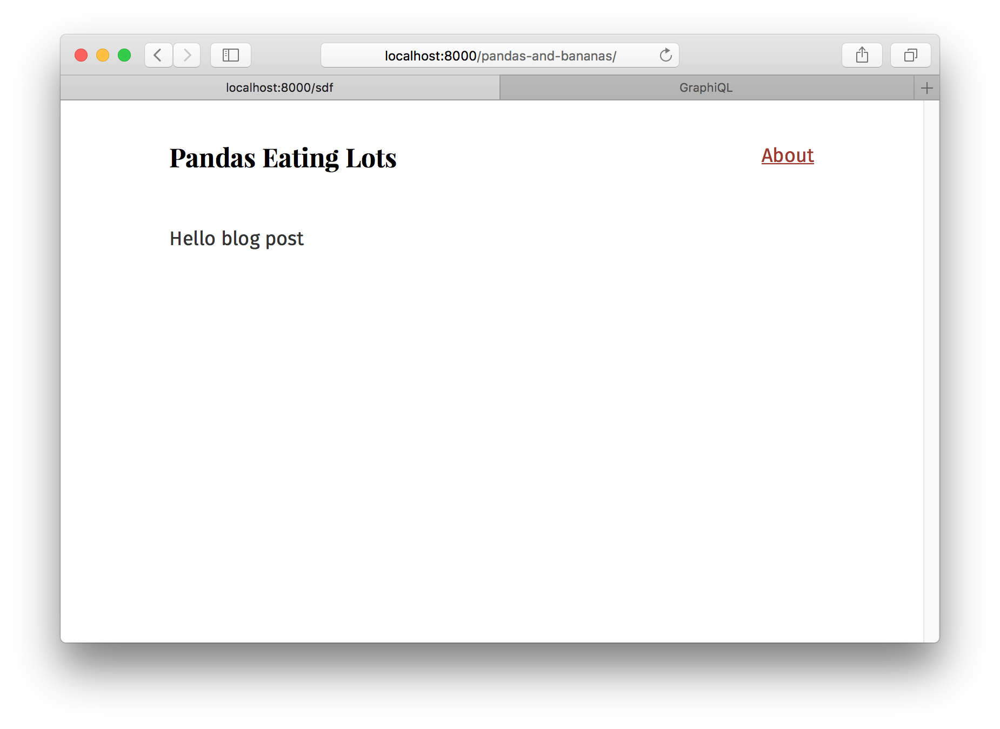

Which is a bit boring. Let's pull in data from our markdown post. Change `src/templates/blog-post.js` to:

```jsx
import React from "react"

export default ({ data }) => {
  const post = data.markdownRemark
  return (
    <div>
      <h1>
        {post.frontmatter.title}
      </h1>
      <div dangerouslySetInnerHTML={{ __html: post.html }} />
    </div>
  )
}

export const query = graphql`
  query BlogPostQuery($slug: String!) {
    markdownRemark(fields: { slug: { eq: $slug } }) {
      html
      frontmatter {
        title
      }
    }
  }
`
```

And…

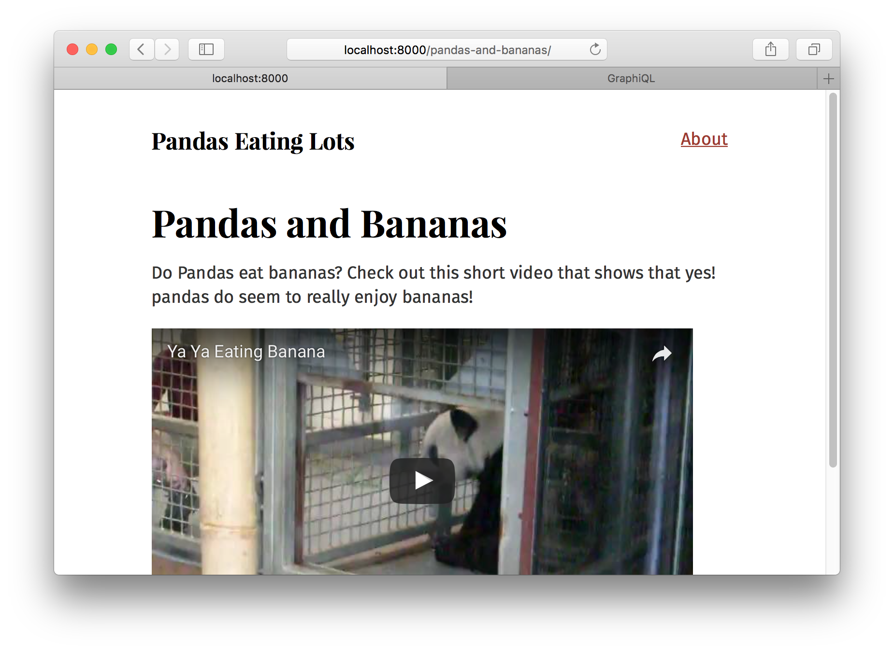

Sweet!

The last step is to link to our new pages from the index page.

Return to `src/pages/index.js` and let's query for our markdown slugs and create links.

```jsx{3,18-19,29,46-48}
import React from "react"
import g from "glamorous"
import Link from "gatsby-link"

import { rhythm } from "../utils/typography"

export default ({ data }) => {
  return (
    <div>
      <g.H1 display={"inline-block"} borderBottom={"1px solid"}>
        Amazing Pandas Eating Things
      </g.H1>
      <h4>
        {data.allMarkdownRemark.totalCount} Posts
      </h4>
      {data.allMarkdownRemark.edges.map(({ node }) =>
        <div key={node.id}>
          <Link
            to={node.fields.slug}
            css={{ textDecoration: `none`, color: `inherit` }}
          >
            <g.H3 marginBottom={rhythm(1 / 4)}>
              {node.frontmatter.title}{" "}
              <g.Span color="#BBB">— {node.frontmatter.date}</g.Span>
            </g.H3>
            <p>
              {node.excerpt}
            </p>
          </Link>
        </div>
      )}
    </div>
  )
}

export const query = graphql`
  query IndexQuery {
    allMarkdownRemark(sort: { fields: [frontmatter___date], order: DESC }) {
      totalCount
      edges {
        node {
          frontmatter {
            title
            date(formatString: "DD MMMM, YYYY")
          }
          fields {
            slug
          }
          excerpt
        }
      }
    }
  }
`
```

And there we go! A working (albeit quite simple still) blog!

Try playing more with the site. Try adding some more markdown files. Explore querying other data from the `MarkdownRemark` nodes and adding them to the frontpage or blog posts pages.

In this part of the tutorial, we've learned the foundations of building with Gatsby's data layer. You've learned how to *source* and *transform* data using plugins. How to use GraphQL to *map* data to pages. Then how to build *page template components* where you query for data for each page.