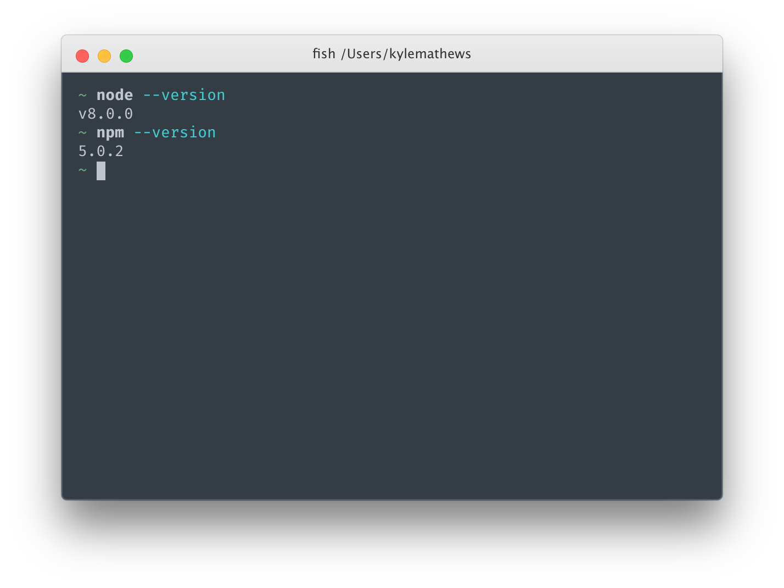
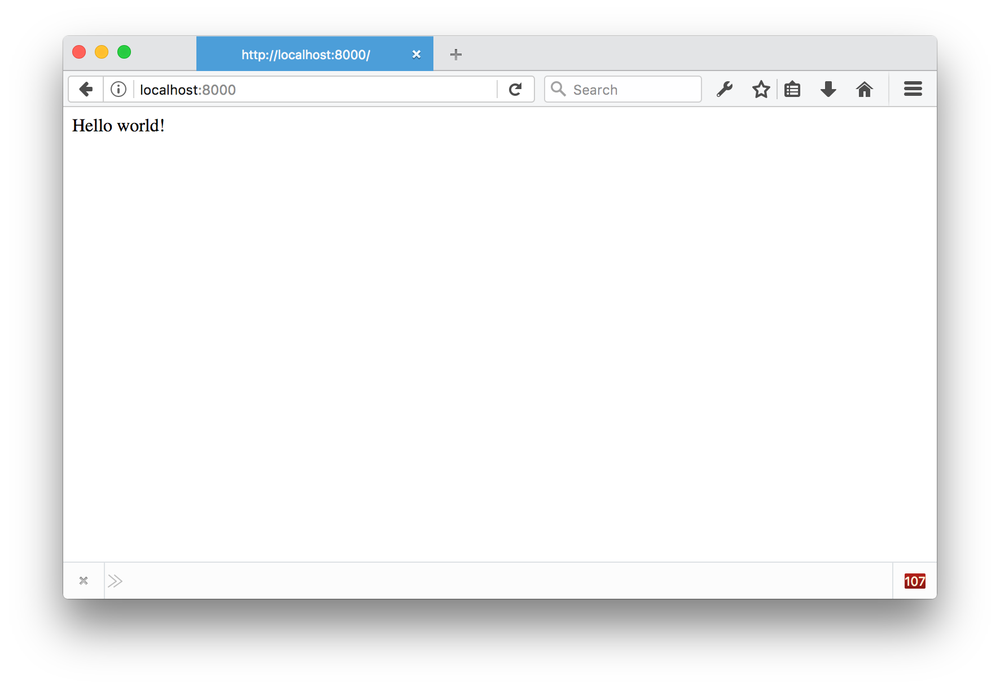
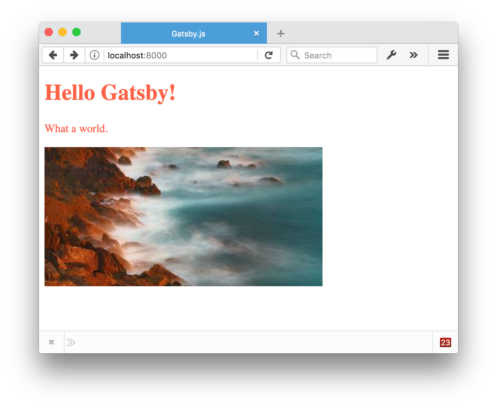
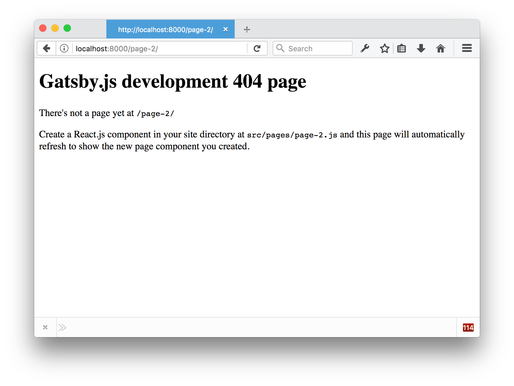
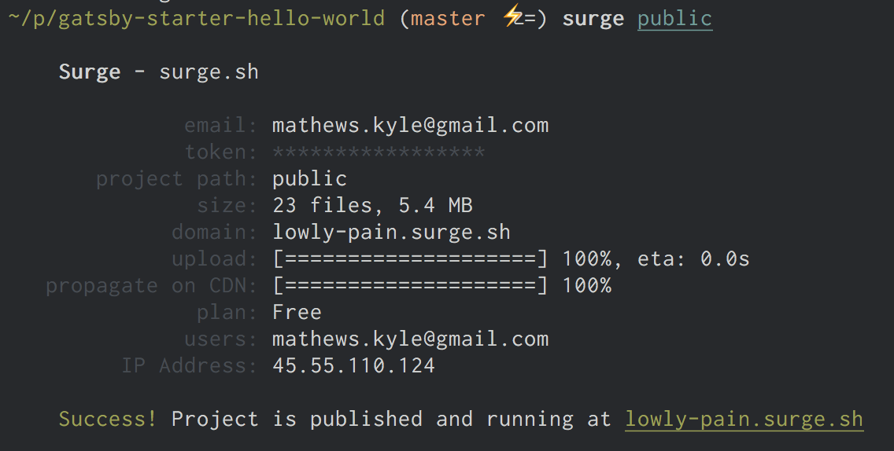

使用Gatsby的朋友们，大家好！ 欢迎来到我们社区的第一部分Gatsby.js教程。

在本教程中，我们将给你介绍Gatsby的开发环境，如何创建组件页面以及如何构建和部署Gatsby网站。

坐好了， 系上安全带，我们出发了！

## 检查你的开发环境

首先检查一下你是否已经设置了好了一切，然后Gatsby创建。 你需要安装最新版本的Node.js。

Node.js是在服务器和终端上运行JavaScript的编程工具。 盖茨比是用Node.js构建的。

打开一个终端窗口。 Mac用户请参阅这些说明，Windows用户请参阅其它说明。 在你的终端窗口中，输入node --version，然后输入npm --version。

你会看到以下信息：



Gatsby支持的Node的最小版本是v4, NPM的版本是V3.

如果您没有安装Node.js，请到https://nodejs.org/并安装适用于您的操作系统的推荐版本。

## 安装“Hello World”启动器(Starter)

Gatsby使用“Starters”开始新项目 顾名思义，“starters”部分建立了预先配置的Gatsby网站，以帮助您更快地开始。 有一些官方的的“starters”和许多其他从Gatsby社区贡献的“starters”！ 详细信息请查看 Starters页面

要安装starter，首先在终端窗口中输入以下命令来安装Gatsby的终端程序，然后按下ENTER键。

```sh
npm install --global gatsby-cli
```

安装完成后，在中输入以下命令并按Enter键：

```sh
gatsby new tutorial-part-one https://github.com/gatsbyjs/gatsby-starter-hello-world
```

该命令下载启动程序的文件，然后安装所需的NPM软件包。 完成大约需要1.5-3分钟。 一开始可能看起来没有任何事情发生， 耐心一点！

现在我们来试试运行Gatsby！

Gatsby有一个内置的开发服务器。 让我们通过在本教程中使用的终端窗口中输入以下命令来启动它。

```sh
cd tutorial-part-one
gatsby develop
```

您应该很快会看到一些文字说明开发服务器正在监听：http://localhost:8000。 在您的浏览器中打开该地址，然后...



这样，它就开始工作了！

是不是很酷？ 

Gatsby的开发服务器是一个“热加载”服务器，这意味着您对React.js页面组件（以及后来我们将了解的，您的数据文件）所做的任何更改都将在浏览器中重新加载。

这是它最大的优点，因为它使开发更快更有趣。

让我们试一下!

本教程的下一部分需要使用代码编辑软件。 VS Code是一个不错的选择。 使用代码编辑器，在计算机上打开一个名为“tutorial-part-one”的文件夹。 当你在本教程的第一部分中运行先前的终端命令时，该文件夹是自动创建的。

现在，您已经在代码编辑软件中打开了“tutorial-part-one”文件夹，现在可以编辑您的网站了。 在代码编辑软件中，您需要找到`` src/pages/index.js</ code>。 一旦你发现，尝试在页面组件中把“Hello World！”修改为 “Hello Gatsby！”。 浏览器中的文本会随着改变。</p>

<p>尝试一些其他的技巧，如下所示：</p>

<ol>
<li><p>Gatsby允许您通过JavaScript风格的“prop”属性添加“内联风格”（稍后我们将了解其他样式选项）。</p>

<p>尝试使您的页面组件如下所示：</p></li>
</ol>

<pre><code class="jsx">import React from "react"

export default () => <div style={{ color: `blue` }}>Hello Gatsby!</div>
``</pre> 

将颜色更改为“粉红色”。 然后去“番茄色”。

1. 添加一些段落文字。

```jsx{5-6}
import React from "react"

export default () =>
 <div style={{ color: `tomato` }}>
   <h1>Hello Gatsby!</h1>
   <p>What a world.</p>
 </div>
```

1. 添加一张图片。

```jsx{7}
import React from "react"

export default () =>
 <div style={{ color: `tomato` }}>
   <h1>Hello Gatsby!</h1>
   <p>What a world.</p>
   
 </div>
```

现在你的屏幕应该看起来像这样。



## 链接页面

网站是页面和页面之间的链接。 虽然我们现在已经有了一个非常甜蜜的第一页，一个页面，没有任何联系不感觉很webby。 所以让我们创建一个新的页面。

首先创建到新页面的链接。

因此，请从与启动器一起安装的gatsby-link软件包中导入

<Link />
组件。

与普通的HTML <a>元素不同，我们的链接组件用于指定要链接的页面。 让我们链接到一个路径名为/page-2 /的页面。 尝试添加。 Once you're done, the page component should look like:</p> 

<pre><code class="jsx{2,9-12}">import React from "react"
import Link from "gatsby-link"

export default () =&gt;
  &lt;div style={{ color: `tomato` }}&gt;
    &lt;h1&gt;Hello Gatsby!&lt;/h1&gt;
    &lt;p&gt;What a world.&lt;/p&gt;
    &lt;img src="http://lorempixel.com/400/200/" alt="" /&gt;
    &lt;br /&gt;
    &lt;div&gt;
      &lt;Link to="/page-2/"&gt;Link&lt;/Link&gt;
    &lt;/div&gt;
  &lt;/div&gt;
</code></pre>

<p>
  点击该链接，你应该看到：
</p>

<p>
  
</p>

<p>
  你看到的是Gatsby.js开发404页面。 让我们按照自己的说法在src/pages/page-2.js创建一个React.js页面组件。
</p>

<p>
  使第二个页面组件如下所示：
</p>

<pre><code class="jsx">import React from "react"
import Link from "gatsby-link"

export default () =&gt;
  &lt;div&gt;
    &lt;p&gt;Hello world from my second Gatsby page&lt;/p&gt;
    &lt;Link to="/"&gt;back home&lt;/Link&gt;
  &lt;/div&gt;
</code></pre>

<p>
  保存之后，现在你应该能够在两个页面之间来回点击！
</p>

<video controls="controls" autoplay="true" loop="true">
  <source type="video/mp4" src="/images/clicking-2.mp4"></source>
  <p>Your browser does not support the video element.</p>
</video>

<h2>
  Interactive page
</h2>

<p>
  One nice thing about using Gatsby for building websites vs other tools is it's so easy to add interactivity to your pages. React.js was designed for Facebook.com and is used on many other world-class web applications.
</p>

<p>
  Let's see how easy it is to add interactive elements to our pages.
</p>

<p>
  We'll start by creating a new link to a page at <code>/counter</code>/ from our original <code>index.js</code> page component <code>&lt;Link to="/counter/"&gt;Counter&lt;/Link&gt;</code>.
</p>

<pre><code class="jsx{13-15}">import React from "react"
import Link from "gatsby-link"

export default () =&gt;
  &lt;div style={{ color: `tomato` }}&gt;
    &lt;h1&gt;Hello Gatsby!&lt;/h1&gt;
    &lt;p&gt;What a world.&lt;/p&gt;
    &lt;img src="http://lorempixel.com/400/200/" alt="" /&gt;
    &lt;br /&gt;
    &lt;div&gt;
      &lt;Link to="/page-2/"&gt;Link&lt;/Link&gt;
    &lt;/div&gt;
    &lt;div&gt;
      &lt;Link to="/counter/"&gt;Counter&lt;/Link&gt;
    &lt;/div&gt;
  &lt;/div&gt;
</code></pre>

<p>
  Add that link, click on it, and then we'll create a "Hello World" page component for <code>/counter/</code> as before. But instead of using the "functional component" form as we did before, we'll create a "class" component.
</p>

<pre><code class="jsx">import React from "react"

class Counter extends React.Component {
  render() {
    return &lt;div&gt;Hello Class Component&lt;/div&gt;
  }
}

export default Counter
</code></pre>

<p>
  The class form of React allows us to have component state. We'll need that for our counter.
</p>

<p>
  Let's continue to flesh out our counter. Let's add two buttons. One to increment and one to decrement the count of the counter.
</p>

<pre><code class="jsx{5-12}">import React from "react"

class Counter extends React.Component {
  render() {
    return (
      &lt;div&gt;
        &lt;h1&gt;Counter&lt;/h1&gt;
        &lt;p&gt;current count: 0&lt;/p&gt;
        &lt;button&gt;plus&lt;/button&gt;
        &lt;button&gt;minus&lt;/button&gt;
      &lt;/div&gt;
    )
  }
}

export default Counter
</code></pre>

<p>
  So now we have everything we need to make a nice counter. Let's make it live.
</p>

<p>
  First we'll setup the component state.
</p>

<pre><code class="jsx{4-7,13}">import React from "react"

class Counter extends React.Component {
  constructor() {
    super()
    this.state = { count: 0 }
  }

  render() {
    return (
      &lt;div&gt;
        &lt;h1&gt;Counter&lt;/h1&gt;
        &lt;p&gt;current count: {this.state.count}&lt;/p&gt;
        &lt;button&gt;plus&lt;/button&gt;
        &lt;button&gt;minus&lt;/button&gt;
      &lt;/div&gt;
    )
  }
}

export default Counter
</code></pre>

<p>
  We're now rendering the current count from the component state.
</p>

<p>
  Let's now change the state when we click on our buttons.
</p>

<pre><code class="jsx{14-19}">import React from "react"

class Counter extends React.Component {
  constructor() {
    super()
    this.state = { count: 0 }
  }

  render() {
    return (
      &lt;div&gt;
        &lt;h1&gt;Counter&lt;/h1&gt;
        &lt;p&gt;current count: {this.state.count}&lt;/p&gt;
        &lt;button onClick={() =&gt; this.setState({ count: this.state.count + 1 })}&gt;
          plus
        &lt;/button&gt;
        &lt;button onClick={() =&gt; this.setState({ count: this.state.count - 1 })}&gt;
          minus
        &lt;/button&gt;
      &lt;/div&gt;
    )
  }
}

export default Counter
</code></pre>

<p>
  There you go! A working React.js counter inside your static website
</p>

<p>
  One fun thing too is that hot reloading isn't just for content and styles but it works on code as well. Try changing the amount by which clicking on the buttons changes the count.
</p>

<h2>
  Deploying Gatsby.js websites on the web
</h2>

<p>
  Gatsby.js is a <em>static site generator</em> which makes deploying Gatsby sites to the web really easy. There are no servers to setup or complicated databases to deploy. Instead, the Gatsby <code>build</code> command produces a directory of static HTML and JavaScript files which you can deploy to a static site hosting service.
</p>

<p>
  Let's try using <a href="http://surge.sh/">Surge</a> for deploying our first Gatsby website. Surge is one of many "static site hosts" which make it really easy to deploy Gatsby sites.
</p>

<p>
  First install their terminal tool:
</p>

<pre><code class="bash">npm install --global surge
</code></pre>

<p>
  Then build your site by running in the terminal at the root of your site:
</p>

<pre><code class="bash">gatsby build
</code></pre>

<p>
  Building should take 15-30 seconds. Take a look at the generated files by looking at the <code>public</code> directory:
</p>

<pre><code class="bash">ls public
</code></pre>

<p>
  Then finally deploy your site by publishing the generated files to surge.sh. You'll first need to create a (free) account by typing <code>surge</code>. Then run:
</p>

<pre><code class="bash">surge public/
</code></pre>

<p>
  Once this finishes running, you should see in your terminal something like:
</p>

<p>
  
</p>

<p>
  Open the web address listed on the bottom line (<code>lowly-pain.surge.sh</code> in this case) and you'll see your newly published site!
</p>

<h2>
  Good work!
</h2>

<p>
  In this tutorial, you've installed Gatsby, played in the development environment, and deployed your first site! Awesome! We hope you're enjoying yourself so far. Feel free to continue now to <a href="/tutorial/part-two/">the second part of the tutorial</a> or go exploring around the rest of the site.
</p>