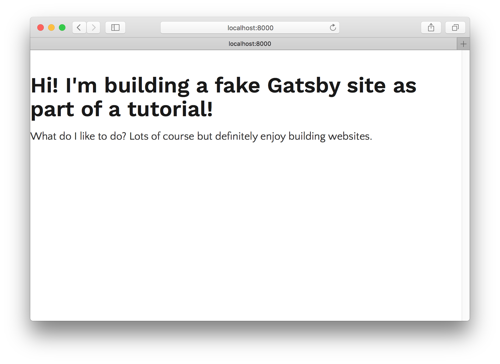

盖茨比让你轻松创建“布局组件”。 布局组件是您要在多个页面上共享的网站部分。 例如，Gatsby网站通常会有一个共享页眉和页脚的布局组件。 其他常见的东西添加到布局是侧边栏和导航菜单。

在这个页面上，左边的边栏（假设你在一个更大的设备上）和顶部的头部是gatsbyjs.org布局组件的一部分。

让我们深入探索盖茨比的布局。

首先，为本教程的这一部分创建一个新的站点。 我们将再次使用“hello world”启动器(Starter)。

```shell
gatsby new tutorial-part-three https://github.com/gatsbyjs/gatsby-starter-hello-world
```

一旦网站完成安装，请安装gatsby-plugin-typography。 对于Typography.js主题，我们来试试这个“童话门”的排版主题吧。

```shell
npm install --save gatsby-plugin-typography typography-theme-fairy-gates
```

在src/utils/typography.js中创建排版配置文件

```javascript
import Typography from "typography"
import fairyGateTheme from "typography-theme-fairy-gates"

const typography = new Typography(fairyGateTheme)

module.exports = typography
```

那么我们的网站的gatsby-config.js

```javascript
module.exports = {
  plugins: [
    {
      resolve: `gatsby-plugin-typography`,
      options: {
        pathToConfigModule: `src/utils/typography.js`,
      },
    },
  ],
}
```

现在，我们添加几个不同的页面：一个首页，一个关于页面和一个联系页面。

`src/pages/index.js`

```jsx
import React from "react"

export default () =>
  <div>
    <h1>Hi! I'm building a fake Gatsby site as part of a tutorial!</h1>
    <p>
      What do I like to do? Lots of course but definitely enjoy building
      websites.
    </p>
  </div>
```

`src/pages/about.js`

```jsx
import React from "react"

export default () =>
  <div>
    <h1>About me</h1>
    <p>I’m good enough, I’m smart enough, and gosh darn it, people like me!</p>
  </div>
```

`src/pages/contact.js`

```jsx
import React from "react"

export default () =>
  <div>
    <h1>I'd love to talk! Email me at the address below</h1>
    <p>
      <a href="mailto:me@example.com">me@example.com</a>
    </p>
  </div>
```



我们现在有一个很好的个人网站的开始！

但是有一些问题。 首先，如果页面内容像教程的第二部分那样集中在屏幕上，那就好了。 其次，我们真的应该有一些全球导航，所以访问者很容易找到并访问每个子页面。

让我们通过创建我们的第一个布局组件来解决这些问题。

## 我们的第一个布局组件

首先，在src/layouts创建一个新目录。 所有布局组件都必须位于此目录中。

让我们在src/layouts/index.js创建一个非常简单的布局组件

```jsx
import React from "react"

export default ({ children }) =>
  <div style={{ margin: `0 auto`, maxWidth: 650, padding: `0 1rem` }}>
    {children()}
  </div>
```

停止gatsby develop，并重新启动新的布局生效。


甜美的是，布局正在像现在一样工作，我们的文本被中心化，并且被限制在我们指定的650像素宽的列上。

现在添加我们的网站标题。

```jsx{5}
import React from "react"

export default ({ children }) =>
  <div style={{ margin: `0 auto`, maxWidth: 650, padding: `0 1rem` }}>
    <h3>MySweetSite</h3>
    {children()}
  </div>
```

如果我们转到三个页面中的任何一页，我们会看到相同的标题，例如 /about/page：


让我们为我们的三个页面添加导航链接。

```jsx{2-9,12-22}
import React from "react"
import Link from "gatsby-link"

const ListLink = props =>
  <li style={{ display: `inline-block`, marginRight: `1rem` }}>
    <Link to={props.to}>
      {props.children}
    </Link>
  </li>

export default ({ children }) =>
  <div style={{ margin: `0 auto`, maxWidth: 650, padding: `1.25rem 1rem` }}>
    <header style={{ marginBottom: `1.5rem` }}>
      <Link to="/" style={{ textShadow: `none`, backgroundImage: `none` }}>
        <h3 style={{ display: `inline` }}>MySweetSite</h3>
      </Link>
      <ul style={{ listStyle: `none`, float: `right` }}>
        <ListLink to="/">Home</ListLink>
        <ListLink to="/about/">About</ListLink>
        <ListLink to="/contact/">Contact</ListLink>
      </ul>
    </header>
    {children()}
  </div>
```


我们终于得到它了！ 一个简单的全局导航的三页网站。

有了您的新“布局组件”的能力，您可以轻松地添加标题，页脚，全球导航，侧边栏等到您的Gatsby网站。

继续阅读本教程的第四部分，我们将开始了解Gatsby的数据层和编程页面！