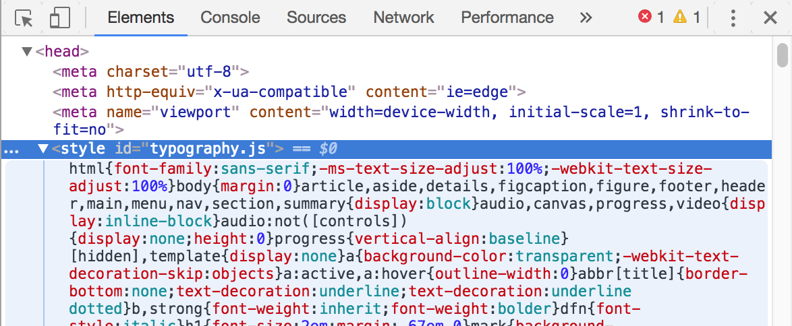
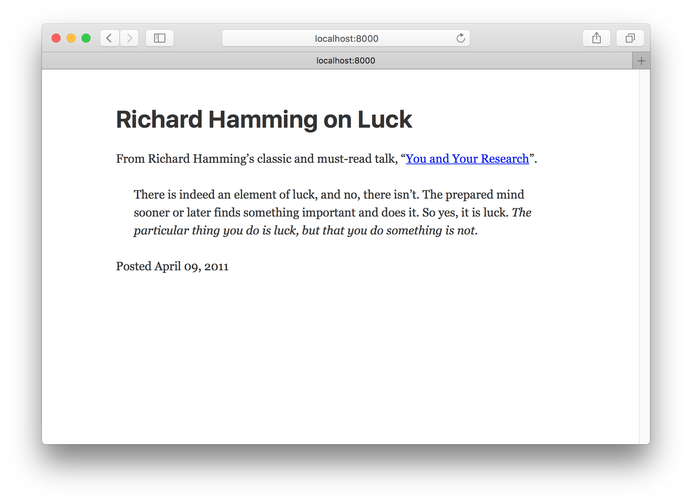
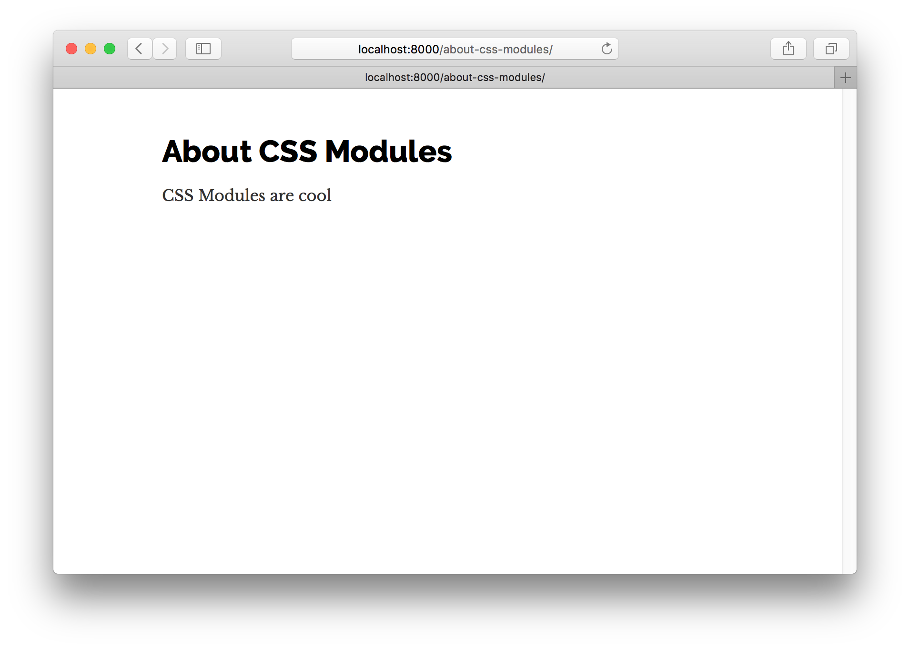

欢迎来到Gatsby教程的第二部分！

在这一部分，我们将探索Gatsby网站的样式选择，并深入探讨如何使用React组件来构建网站。

## 用组件构建

在开始构建组件时，您所做的一个重大转变就是现在您的CSS，HTML和JavaScript紧密结合，甚至在同一个文件中也是如此。

虽然看似简单的变化，但它对于如何考虑构建网站有着深远的影响。

以创建自定义按钮的简单示例为例。 在过去，你会创建一个CSS类（可能.primary-button）与你的自定义样式，然后当你想要应用这些样式，例如

```html
<button class="primary-button">
  Click me
</button>
```

在组件的世界中，您可以使用按钮样式创建一个PrimaryButton组件，并在整个站点中使用它，如下所示：

```jsx
<PrimaryButton>Click me</PrimaryButton>
```

组件成为您网站的基础构建块。 而不仅限于浏览器提供的内容，例如 <button>，您可以轻松地创建优雅地满足项目需求的新建筑模块。</p> 

<h2>
  创建全局样式
</h2>

<p>
  每个网站都有一些全局的样式。 这包括网站的排版和背景颜色。 这些样式设置了网站的整体感觉 - 就像墙壁的颜色和纹理设置了整个房间的感觉。
</p>

<p>
  通常人们会使用像Bootstrap或Foundation这样的全局风格。 问题是它们很难定制，而且它们不能与React组件配合使用。
</p>

<p>
  因此，在本教程中，我们来探索一个名为Typography.js的JavaScript库，它可以生成全局样式，并且可以与Gatsby和React一起使用。
</p>

<h3>
  Typography.js
</h3>

<p>
  Typography.js是一个生成印刷CSS的JavaScript库。
</p>

<p>
  您不需要直接设置不同的HTML元素的字体大小，而是通过Typography.js来获得所需的baseFontSize和baseLineHeight，并根据这些信息生成所有元素的基本CSS。
</p>

<p>
  这使得更改站点上所有元素的字体大小变得微不足道，而无需直接修改很多CSS规则。
</p>

<p>
  使用它看起来像这样:
</p>

<pre><code class="javascript">import Typography from "typography"

const typography = new Typography({
  baseFontSize: '18px',
  baseLineHeight: 1.45,
  headerFontFamily: ['Avenir Next', 'Helvetica Neue', 'Segoe UI', 'Helvetica', 'Arial', 'sans-serif'],
  bodyFontFamily: ['Georgia', 'serif'],
})
</code></pre>

<h2>
  Gatsby plugins
</h2>

<p>
  But before we can get back to building and trying out Typography.js, let's make a quick diversion and talk about Gatsby plugins.
</p>

<p>
  You're probably familiar with the idea of plugins. Many software systems support adding custom plugins to add new functionality or even modify the core workings of the software.
</p>

<p>
  Gatsby plugins work the same way.
</p>

<p>
  Community members (like you!) can contribute plugins (small amounts of JavaScript code) that others can then use when building Gatsby sites.
</p>

<p>
  There's already dozens of plugins! Check them out at the <a href="/docs/plugins/">plugins section of the site</a>.
</p>

<p>
  Gatsby plugins are easy to install and use. In almost every Gatsby site you build, you will be installing plugins. While working through the rest of the tutorial, you'll have many opportunities to practice installing and using plugins.
</p>

<h2>
  Installing your first Gatsby plugin
</h2>

<p>
  Let's start by creating a new site. Similar to Part One, run the following to create a new site.
</p>

<pre><code>gatsby new tutorial-part-two https://github.com/gatsbyjs/gatsby-starter-hello-world
</code></pre>

<p>
  This creates a new site with the following structure.
</p>

<pre><code class="shell">├── package.json
├── src
│   └── pages
│       └── index.js
</code></pre>

<p>
  This is the minimal setup for a Gatsby site.
</p>

<p>
  To install a plugin, there's two steps. First you install the plugin's NPM package and second you add the plugin to your site's <code>gatsby-config.js</code>.
</p>

<p>
  Typography.js has a Gatsby plugin, so let's install that by running:
</p>

<pre><code class="shell">npm install --save gatsby-plugin-typography
</code></pre>

<p>
  Next, create a file at the root of your project folder named <code>gatsby-config.js</code>. This is where you add plugins to a site along with other site configuration.
</p>

<p>
  Copy the following into <code>gatsby-config.js</code>
</p>

<pre><code class="javascript">module.exports = {
  plugins: [`gatsby-plugin-typography`],
}
</code></pre>

<p>
  Gatsby reads the site's config file when starting. Here we tell it to look for a plugin named <code>gatsby-plugin-typography</code>. Gatsby knows to look for plugins that are NPM packages so it will find the package we installed previously.
</p>

<p>
  Now run <code>gatsby develop</code>. Once you load the site, if you inspect the generated HTML using the Chrome developer tools, you'll see that the typography plugin added a <code>&lt;style&gt;</code> element to the <code>&lt;head&gt;</code> element with its generated CSS.
</p>

<p>
  
</p>

<p>
  Copy the following into your <code>src/pages/index.js</code> so we can better see the effect of the typography CSS generated by Typography.js.
</p>

<pre><code class="jsx">import React from "react"

export default () =&gt;
  &lt;div&gt;
    &lt;h1&gt;Richard Hamming on Luck&lt;/h1&gt;
    &lt;div&gt;
      &lt;p&gt;
        From Richard Hamming’s classic and must-read talk, “&lt;a href="http://www.cs.virginia.edu/~robins/YouAndYourResearch.html"&gt;
          You and Your Research
        &lt;/a&gt;”.
      &lt;/p&gt;
      &lt;blockquote&gt;
        &lt;p&gt;
          There is indeed an element of luck, and no, there isn’t. The prepared
          mind sooner or later finds something important and does it. So yes, it
          is luck.{" "}
          &lt;em&gt;
            The particular thing you do is luck, but that you do something is
            not.
          &lt;/em&gt;
        &lt;/p&gt;
      &lt;/blockquote&gt;
    &lt;/div&gt;
    &lt;p&gt;Posted April 09, 2011&lt;/p&gt;
  &lt;/div&gt;
</code></pre>

<p>
  Your site should now look like this:
</p>

<p>
  
</p>

<p>
  Let's make a quick improvement. Many sites have a single column of text centered in the middle of the page. To create this, add the following styles to the <code>&lt;div&gt;</code> in <code>src/pages/index.js</code>.
</p>

<pre><code class="jsx{4}">import React from "react"

export default () =&gt;
  &lt;div style={{ margin: '3rem auto', maxWidth: 600 }}&gt;
    &lt;h1&gt;Richard Hamming on Luck&lt;/h1&gt;
    &lt;div&gt;
      &lt;p&gt;
        From Richard Hamming’s classic and must-read talk, “&lt;a href="http://www.cs.virginia.edu/~robins/YouAndYourResearch.html"&gt;
          You and Your Research
        &lt;/a&gt;”.
      &lt;/p&gt;
      &lt;blockquote&gt;
        &lt;p&gt;
          There is indeed an element of luck, and no, there isn’t. The prepared
          mind sooner or later finds something important and does it. So yes, it
          is luck.{" "}
          &lt;em&gt;
            The particular thing you do is luck, but that you do something is
            not.
          &lt;/em&gt;
        &lt;/p&gt;
      &lt;/blockquote&gt;
    &lt;/div&gt;
    &lt;p&gt;Posted April 09, 2011&lt;/p&gt;
  &lt;/div&gt;
</code></pre>

<p>
  
</p>

<p>
  Ah, this is starting to look nice!
</p>

<p>
  What we're seeing here is the default CSS Typography.js produces. We can easily customize it, however. Let's do that.
</p>

<p>
  In your site, create a new directory at <code>src/utils</code>. There create a file named <code>typography.js</code>. In it, add the following code.
</p>

<pre><code class="javascript">import Typography from "typography"

const typography = new Typography({ baseFontSize: '18px' })

export default typography
</code></pre>

<p>
  Then set this module to be used by <code>gatsby-plugin-typography</code> as its config in our <code>gatsby-config.js</code> file.
</p>

<pre><code class="javascript{2..9}">module.exports = {
  plugins: [
    {
      resolve: `gatsby-plugin-typography`,
      options: {
        pathToConfigModule: `src/utils/typography.js`,
      },
    },
  ],
}
</code></pre>

<p>
  Stop <code>gatsby develop</code> and then restart it again for our plugin change to take effect.
</p>

<p>
  Now all the text font sizes should be slightly bigger. Try changing the <code>baseFontSize</code> to <code>24px</code> then <code>12px</code>. All elements get resized as their <code>font-size</code> is based on the <code>baseFontSize</code>.
</p>

<p>
  There are <a href="https://github.com/KyleAMathews/typography.js#published-typographyjs-themes">many themes available</a> for Typography.js. Let's try a couple. Run in your terminal at the root of your site:
</p>

<pre><code class="shell">npm install --save typography-theme-bootstrap typography-theme-lawton
</code></pre>

<p>
  To use the Bootstrap theme, change your typography code to:
</p>

<pre><code class="javascript{2,4}">import Typography from "typography"
import bootstrapTheme from "typography-theme-bootstrap"

const typography = new Typography(bootstrapTheme)

export default typography
</code></pre>

<p>
  
</p>

<p>
  Themes can also add Google Fonts. The Lawton theme we installed along with the Bootstrap theme does this. Replace your typography module code with the following, then restart the dev server (necessary to load the new Google Fonts).
</p>

<pre><code class="javascript{2-3,5}">import Typography from "typography"
// import bootstrapTheme from "typography-theme-bootstrap"
import lawtonTheme from "typography-theme-lawton"

const typography = new Typography(lawtonTheme)

export default typography
</code></pre>

<p>
  
</p>

<p>
  Typography.js has more than 30 themes! <a href="http://kyleamathews.github.io/typography.js">Try them live</a> or check out <a href="https://github.com/KyleAMathews/typography.js#published-typographyjs-themes">the complete list</a>
</p>

<h2>
  Component CSS
</h2>

<p>
  Gatsby has a wealth of options available for styling components. Let's explore three very popular and production-ready options. We'll build a simple page three times to explore each styling option.
</p>

<p>
  Each is a variant on "CSS-in-JS"—which solves many of the problems with traditional CSS.
</p>

<p>
  One of the most important problems they solve is selector name collisions. With traditional CSS, you have to be careful not to overwrite CSS selectors used elsewhere in a site because all CSS selectors live in the same global namespace. This unfortunate restriction can lead to elaborate (and often confusing) selector naming schemes.
</p>

<p>
  With CSS-in-JS, you avoid all that as CSS selectors are scoped automatically to their component. Styles are tightly coupled with their components. This makes it very easy to know how to edit a component's CSS as there's never any confusion about how and where CSS is being used.
</p>

<p>
  For some background reading on CSS-in-JS, see <a href="https://speakerdeck.com/vjeux/react-css-in-js">Christopher "vjeux" Chedeau's 2014 presentation that sparked this movement</a> as well as <a href="https://medium.com/seek-blog/a-unified-styling-language-d0c208de2660">Mark Dalgleish's more recent post "A Unified Styling Language"</a>.
</p>

<h3>
  CSS Modules
</h3>

<p>
  Let's explore first <strong>CSS Modules</strong>.
</p>

<p>
  Quoting from <a href="https://github.com/css-modules/css-modules">the CSS Module homepage</a>:
</p>

<blockquote>
  <p>
    A <strong>CSS Module</strong> is a CSS file in which all class names and animation names are scoped locally by default.
  </p>
</blockquote>

<p>
  CSS Modules is very popular, as it lets you write CSS like normal but with a lot more safety. The tool automatically makes class and animation names unique so you don't have to worry about selector name collisions.
</p>

<p>
  CSS Modules are highly recommended for those new to building with Gatsby (and React in general).
</p>

<p>
  Gatsby works out of the box with CSS Modules.
</p>

<p>
  Let's build a page using CSS Modules.
</p>

<p>
  First, let's create a new <code>Container</code> component which we'll use for each of the CSS-in-JS examples. Create a <code>components</code> directory at <code>src/components</code> and then, in this directory, create a file named <code>container.js</code> and paste the following.
</p>

<pre><code class="javascript">import React from "react"

export default ({ children }) =&gt;
  &lt;div style={{ margin: "3rem auto", maxWidth: 600 }}&gt;
    {children}
  &lt;/div&gt;
</code></pre>

<p>
  Then create a new component page by creating a file at <code>src/pages/about-css-modules.js</code>:
</p>

<pre><code class="javascript">import React from "react"

import Container from "../components/container"

export default () =&gt;
  &lt;Container&gt;
    &lt;h1&gt;About CSS Modules&lt;/h1&gt;
    &lt;p&gt;CSS Modules are cool&lt;/p&gt;
  &lt;/Container&gt;
</code></pre>

<p>
  You'll notice we imported the <code>Container</code> component we just created.
</p>

<p>
  Your page should now look like:
</p>

<p>
  
</p>

<p>
  Let's create a simple list of people with names, avatars, and short latin biographies.
</p>

<p>
  First, let's create the file for the CSS at <code>src/pages/about-css-modules.module.css</code>. You'll notice that the file name ends with <code>.module.css</code> instead of <code>.css</code> like normal. This is how we tell Gatsby that this CSS file should be processed as CSS modules.
</p>

<pre><code class="css">.user {
  display: flex;
  align-items: center;
  margin: 0 auto 12px auto;
}

.user:last-child {
  margin-bottom: 0;
}

.avatar {
  flex: 0 0 96px;
  width: 96px;
  height: 96px;
  margin: 0;
}

.description {
  flex: 1;
  margin-left: 18px;
  padding: 12px;
}

.username {
  margin: 0 0 12px 0;
  padding: 0;
}

.excerpt {
  margin: 0;
}
</code></pre>

<p>
  Now import that file into the <code>about-css-modules.js</code> page we created earlier. Also log the resulting import so we can see what the processed file looks like.
</p>

<pre><code class="javascript">import styles from "./about-css-modules.module.css"
console.log(styles)
</code></pre>

<p>
  If you open the developer console in your browser you'll see:
</p>

<p>
  
</p>

<p>
  If you compare that to our CSS file, you'll see that each class is now a key in the imported object pointing to a long string e.g. <code>avatar</code> points to <code>about-css-modules-module---avatar----hYcv</code>. These are the class names CSS Modules generates. They're guaranteed to be unique across your site. And because you have to import them to use the classes, there's never any question about where some CSS is being used.
</p>

<p>
  Let's use our styles to create a simple <code>User</code> component.
</p>

<p>
  Let's create the new component inline in the <code>about-css-modules.js</code> page component. The general rule of thumb is if you use a component in multiple places on a site, it should be in its own module file in the <code>components</code> directory. But, if it's used only in one file, create it inline.
</p>

<p>
  Modify <code>about-css-modules.js</code> so it looks like the following:
</p>

<pre><code class="jsx{6-17,23-30}">import React from "react"
import styles from "./about-css-modules.module.css"

import Container from "../components/container"

const User = props =&gt;
  &lt;div className={styles.user}&gt;
    &lt;img src={props.avatar} className={styles.avatar} alt="" /&gt;
    &lt;div className={styles.description}&gt;
      &lt;h2 className={styles.username}&gt;
        {props.username}
      &lt;/h2&gt;
      &lt;p className={styles.excerpt}&gt;
        {props.excerpt}
      &lt;/p&gt;
    &lt;/div&gt;
  &lt;/div&gt;

export default () =&gt;
  &lt;Container&gt;
    &lt;h1&gt;About CSS Modules&lt;/h1&gt;
    &lt;p&gt;CSS Modules are cool&lt;/p&gt;
    &lt;User
      username="Jane Doe"
      avatar="https://s3.amazonaws.com/uifaces/faces/twitter/adellecharles/128.jpg"
      excerpt="I'm Jane Doe. Lorem ipsum dolor sit amet, consectetur adipisicing elit."
    /&gt;
    &lt;User
      username="Bob Smith"
      avatar="https://s3.amazonaws.com/uifaces/faces/twitter/vladarbatov/128.jpg"
      excerpt="I'm Bob smith, a vertically aligned type of guy. Lorem ipsum dolor sit amet, consectetur adipisicing elit."
    /&gt;
  &lt;/Container&gt;
</code></pre>

<p>
  The finished page should now look like:
</p>

<p>
  
</p>

<h3>
  Glamor
</h3>

<p>
  Let's create the same page using <a href="https://github.com/threepointone/glamor">Glamor</a>.
</p>

<p>
  Glamor lets you write <em>real</em> CSS inline in your components using the same Object CSS syntax React supports for the <code>style</code> prop.
</p>

<p>
  First install the Gatsby plugin for Glamor.
</p>

<pre><code class="shell">npm install --save gatsby-plugin-glamor
</code></pre>

<p>
  And then add it to your <code>gatsby-config.js</code>
</p>

<pre><code class="javascript{9}">module.exports = {
  plugins: [
    {
      resolve: `gatsby-plugin-typography`,
      options: {
        pathToConfigModule: `src/utils/typography.js`,
      },
    },
    `gatsby-plugin-glamor`,
  ],
}
</code></pre>

<p>
  Restart <code>gatsby develop</code> again to enable the Glamor plugin.
</p>

<p>
  Now create the Glamor page at <code>src/pages/about-glamor.js</code>
</p>

<pre><code class="jsx">import React from "react"

import Container from "../components/container"

export default () =&gt;
  &lt;Container&gt;
    &lt;h1&gt;About Glamor&lt;/h1&gt;
    &lt;p&gt;Glamor is cool&lt;/p&gt;
  &lt;/Container&gt;
</code></pre>

<p>
  Let's add the same inline <code>User</code> component but this time using Glamor's <code>css</code> prop.
</p>

<pre><code class="jsx{5-26,32-40}">import React from "react"

import Container from "../components/container"

const User = props =&gt;
  &lt;div
    css={{
      display: `flex`,
      alignItems: `center`,
      margin: `0 auto 12px auto`,
      "&:last-child": { marginBottom: 0 }
    }}
  &gt;
    &lt;img
      src={props.avatar}
      css={{ flex: `0 0 96px`, width: 96, height: 96, margin: 0 }}
      alt=""
    /&gt;
    &lt;div css={{ flex: 1, marginLeft: 18, padding: 12 }}&gt;
      &lt;h2 css={{ margin: `0 0 12px 0`, padding: 0 }}&gt;
        {props.username}
      &lt;/h2&gt;
      &lt;p css={{ margin: 0 }}&gt;
        {props.excerpt}
      &lt;/p&gt;
    &lt;/div&gt;
  &lt;/div&gt;

export default () =&gt;
  &lt;Container&gt;
    &lt;h1&gt;About Glamor&lt;/h1&gt;
    &lt;p&gt;Glamor is cool&lt;/p&gt;
    &lt;User
      username="Jane Doe"
      avatar="https://s3.amazonaws.com/uifaces/faces/twitter/adellecharles/128.jpg"
      excerpt="I'm Jane Doe. Lorem ipsum dolor sit amet, consectetur adipisicing elit."
    /&gt;
    &lt;User
      username="Bob Smith"
      avatar="https://s3.amazonaws.com/uifaces/faces/twitter/vladarbatov/128.jpg"
      excerpt="I'm Bob smith, a vertically aligned type of guy. Lorem ipsum dolor sit amet, consectetur adipisicing elit."
    /&gt;
  &lt;/Container&gt;
</code></pre>

<p>
  The final Glamor page should look identical to the CSS Modules page.
</p>

<p>
  
</p>

<h3>
  Styled Components
</h3>

<p>
  For our final CSS-in-JS example, we'll try <a href="https://www.styled-components.com/">Styled Components</a>.
</p>

<p>
  Styled Components lets you use actual CSS syntax inside your components.
</p>

<p>
  First, like normal, we'll install the Gatsby plugin for Styled Components.
</p>

<pre><code class="sh">npm install --save gatsby-plugin-styled-components
</code></pre>

<p>
  Then modify the <code>gatsby-config.js</code>. Before we can use Styled Components however, we'll need to remove the Glamor plugin and delete the Glamor component page we created. The two plugins conflict with each other as both want to take control during server rendering.
</p>

<pre><code class="javascript{9}">module.exports = {
  plugins: [
    {
      resolve: `gatsby-plugin-typography`,
      options: {
        pathToConfigModule: `src/utils/typography.js`,
      },
    },
    `gatsby-plugin-styled-components`,
  ],
}
</code></pre>

<p>
  Then at <code>src/pages/about-styled-components.js</code> create:
</p>

<pre><code class="jsx">import React from "react"
import styled from "styled-components"

import Container from "../components/container"

const UserWrapper = styled.div`
  display: flex;
  align-items: center;
  margin: 0 auto 12px auto;
  &:last-child {
    margin-bottom: 0;
  }
`

const Avatar = styled.img`
  flex: 0 0 96px;
  width: 96px;
  height: 96px;
  margin: 0;
`

const Description = styled.div`
  flex: 1;
  margin-left: 18px;
  padding: 12px;
`

const Username = styled.h2`
  margin: 0 0 12px 0;
  padding: 0;
`

const Excerpt = styled.p`margin: 0;`

const User = props =&gt;
  &lt;UserWrapper&gt;
    &lt;Avatar src={props.avatar} alt="" /&gt;
    &lt;Description&gt;
      &lt;Username&gt;
        {props.username}
      &lt;/Username&gt;
      &lt;Excerpt&gt;
        {props.excerpt}
      &lt;/Excerpt&gt;
    &lt;/Description&gt;
  &lt;/UserWrapper&gt;

export default () =&gt;
  &lt;Container&gt;
    &lt;h1&gt;About Styled Components&lt;/h1&gt;
    &lt;p&gt;Styled Components is cool&lt;/p&gt;
    &lt;User
      username="Jane Doe"
      avatar="https://s3.amazonaws.com/uifaces/faces/twitter/adellecharles/128.jpg"
      excerpt="I'm Jane Doe. Lorem ipsum dolor sit amet, consectetur adipisicing elit."
    /&gt;
    &lt;User
      username="Bob Smith"
      avatar="https://s3.amazonaws.com/uifaces/faces/twitter/vladarbatov/128.jpg"
      excerpt="I'm Bob smith, a vertically aligned type of guy. Lorem ipsum dolor sit amet, consectetur adipisicing elit."
    /&gt;
  &lt;/Container&gt;

</code></pre>

<h3>
  Other CSS options
</h3>

<p>
  Gatsby supports almost every possible styling option (if there isn't a plugin yet for your favorite CSS option, <a href="/docs/how-to-contribute/">please contribute one!</a>)
</p>

<ul>
  <li>
    <a href="/packages/gatsby-plugin-sass/">Sass</a>
  </li>
  <li>
    <a href="/packages/gatsby-plugin-emotion/">Emotion</a>
  </li>
  <li>
    <a href="/packages/gatsby-plugin-jss/">JSS</a>
  </li>
  <li>
    <a href="/packages/gatsby-plugin-stylus/">Stylus</a>
  </li>
  <li>
    and more!
  </li>
</ul>

<p>
  Now continue on to <a href="/tutorial/part-three/">Part Three</a> of the tutorial.
</p>