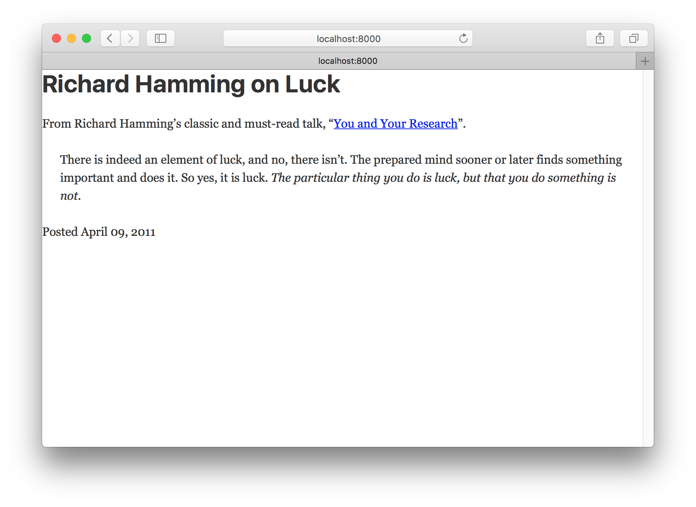
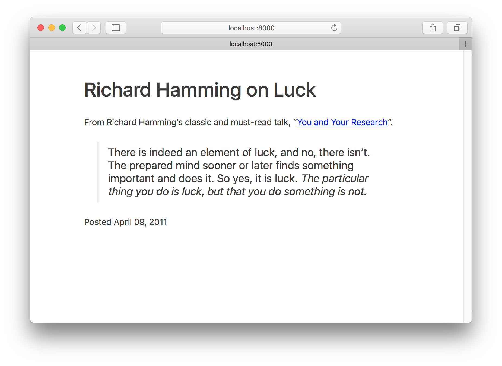
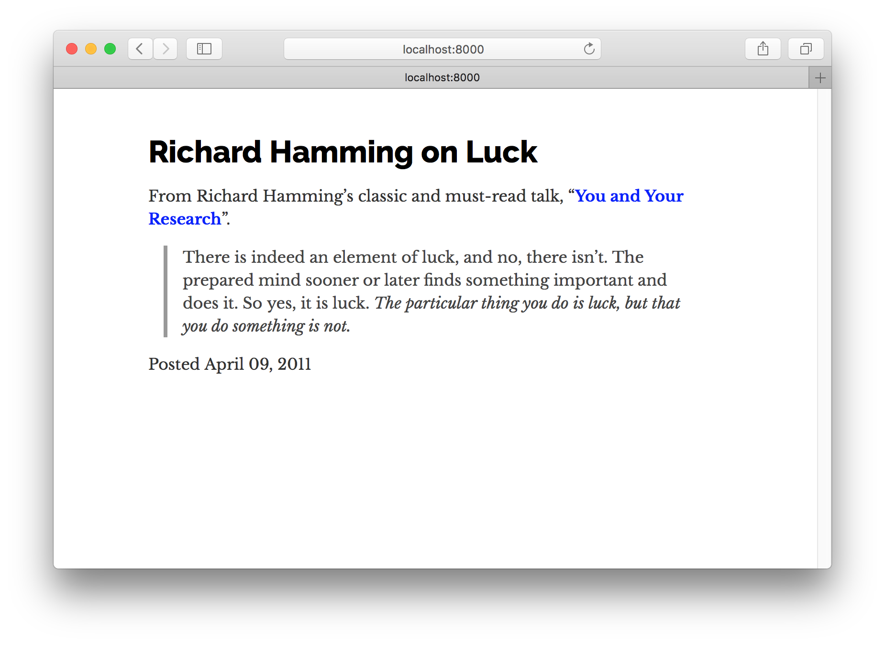
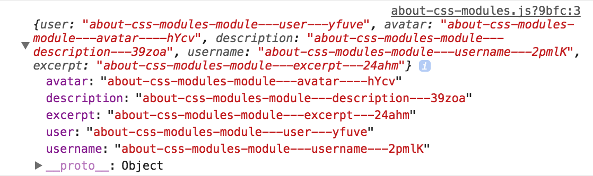
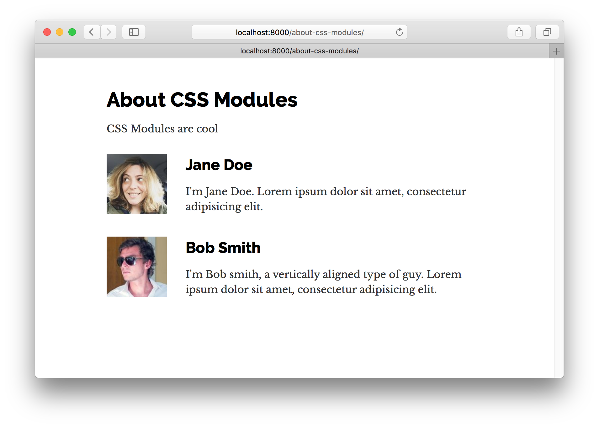
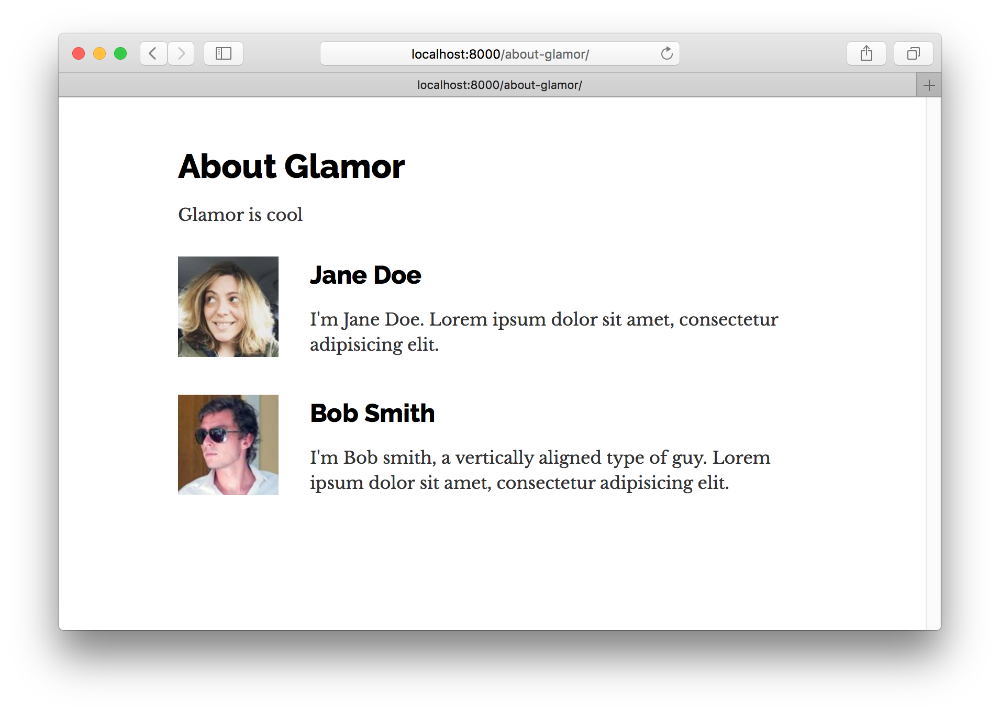

欢迎来到Gatsby教程的第二部分！

在这一部分，我们将探索Gatsby网站的样式选择，并深入探讨如何使用React组件来构建网站。

## 用组件构建

在开始构建组件时，您所做的一个重大转变就是现在您的CSS，HTML和JavaScript紧密结合，甚至在同一个文件中也是如此。

虽然看似简单的变化，但它对于如何考虑构建网站有着深远的影响。

以创建自定义按钮的简单示例为例。 在过去，你会创建一个CSS类（可能.primary-button）与你的自定义样式，然后当你想要应用这些样式，例如

```html
<button class="primary-button">
  Click me
</button>
```

在组件的世界中，您可以使用按钮样式创建一个PrimaryButton组件，并在整个站点中使用它，如下所示：

```jsx
<PrimaryButton>Click me</PrimaryButton>
```

组件成为您网站的基础构建块。 而不仅限于浏览器提供的内容，例如 <button>，您可以轻松地创建优雅地满足项目需求的新建筑模块。</p> 

<h2>
  创建全局样式
</h2>

<p>
  每个网站都有一些全局的样式。 这包括网站的排版和背景颜色。 这些样式设置了网站的整体感觉 - 就像墙壁的颜色和纹理设置了整个房间的感觉。
</p>

<p>
  通常人们会使用像Bootstrap或Foundation这样的全球风格。 问题是它们很难定制，而且它们不能与React组件配合使用。
</p>

<p>
  因此，在本教程中，我们来探索一个名为Typography.js的JavaScript库，它可以生成全局样式，并且可以与Gatsby和React一起使用。
</p>

<h3>
  Typography.js
</h3>

<p>
  Typography.js是一个生成印刷CSS的JavaScript库。
</p>

<p>
  您不需要直接设置不同的HTML元素的字体大小，而是通过Typography.js来获得所需的baseFontSize和baseLineHeight，并根据这些信息生成所有元素的基本CSS。
</p>

<p>
  这使得更改站点上所有元素的字体大小变得微不足道，而无需直接修改很多CSS规则。
</p>

<p>
  使用它看起来像这样:
</p>

<pre><code class="javascript">import Typography from "typography"

const typography = new Typography({
  baseFontSize: '18px',
  baseLineHeight: 1.45,
  headerFontFamily: ['Avenir Next', 'Helvetica Neue', 'Segoe UI', 'Helvetica', 'Arial', 'sans-serif'],
  bodyFontFamily: ['Georgia', 'serif'],
})
</code></pre>

<h2>
  Gatsby插件
</h2>

<p>
  但在我们回到构建和尝试Typography.js之前，让我们快速转换一下，讨论一下Gatsby插件。
</p>

<p>
  你可能很熟悉插件的概念。 许多软件系统都支持添加自定义插件来添加新功能，甚至修改软件的核心工作。
</p>

<p>
  盖茨比插件以同样的方式工作。
</p>

<p>
  社区成员（比如你）可以贡献插件（少量JavaScript代码），其他人可以在构建Gatsby网站时使用这些插件。
</p>

<p>
  已经有很多的插件了！ 可以从 <a href="/docs/plugins/">plugins section of the site</a>检出.
</p>

<p>
  盖茨比插件很容易安装和使用。 几乎在你建立的每一个Gatsby网站上，你都会安装插件。 在完成本教程的其余部分时，您将有很多机会来练习安装和使用插件。
</p>

<h2>
  安装你的第一个Gatsby插件
</h2>

<p>
  让我们开始创建一个新的网站。 类似于第一部分，运行以下来创建一个新的站点。
</p>

<pre><code>gatsby new tutorial-part-two https://github.com/gatsbyjs/gatsby-starter-hello-world
</code></pre>

<p>
  这会创建一个具有以下结构的新站点。
</p>

<pre><code class="shell">├── package.json
├── src
│   └── pages
│       └── index.js
</code></pre>

<p>
  这是Gatsby网站的最小设置。
</p>

<p>
  要安装插件，有两个步骤。 首先安装插件的NPM包，然后将插件添加到网站的gatsby-config.js中。
</p>

<p>
  Typography.js有一个Gatsby插件，所以让我们通过运行下面命令来安装：
</p>

<pre><code class="shell">npm install --save gatsby-plugin-typography
</code></pre>

<p>
  接下来，在名为gatsby-config.js的项目文件夹的根目录下创建一个文件。 这是您将插件添加到网站以及其他网站配置的地方。
</p>

<p>
  将以下内容复制到gatsby-config.js中
</p>

<pre><code class="javascript">module.exports = {
  plugins: [`gatsby-plugin-typography`],
}
</code></pre>

<p>
  开始时，Gatsby读取站点的配置文件。 在这里，我们告诉它寻找一个名为gatsby-plugin-typography的插件。 盖茨比知道寻找插件是NPM包，所以它会找到我们以前安装的软件包。
</p>

<p>
  现在运行gatsby开发。 加载站点后, 如果您使用 Chrome 开发人员工具检查生成的 HTML, 您会看到排版插件将其生成的 CSS的 <code> &lt;style&gt; </code> 元素添加到 <code> &lt;head&gt; </code> 元素中.
</p>

<p>
  
</p>

<p>
  将以下内容复制到src / pages / index.js中，以便更好地看到Typography.js生成的排版CSS的效果。
</p>

<pre><code class="jsx">import React from "react"

export default () =&gt;
  &lt;div&gt;
    &lt;h1&gt;Richard Hamming on Luck&lt;/h1&gt;
    &lt;div&gt;
      &lt;p&gt;
        From Richard Hamming’s classic and must-read talk, “&lt;a href="http://www.cs.virginia.edu/~robins/YouAndYourResearch.html"&gt;
          You and Your Research
        &lt;/a&gt;”.
      &lt;/p&gt;
      &lt;blockquote&gt;
        &lt;p&gt;
          There is indeed an element of luck, and no, there isn’t. The prepared
          mind sooner or later finds something important and does it. So yes, it
          is luck.{" "}
          &lt;em&gt;
            The particular thing you do is luck, but that you do something is
            not.
          &lt;/em&gt;
        &lt;/p&gt;
      &lt;/blockquote&gt;
    &lt;/div&gt;
    &lt;p&gt;Posted April 09, 2011&lt;/p&gt;
  &lt;/div&gt;
</code></pre>

<p>
  你的网站现在应该是这样的：
</p>

<p>
  
</p>

<p>
  让我们快速改进一下。 许多网站在页面中间有一列文本。 要创建它，请将以下样式添加到<code>src/ pages/index.js</code>中的<code>&lt;div></code>。
</p>

<pre><code class="jsx{4}">import React from "react"

export default () =&gt;
  &lt;div style={{ margin: '3rem auto', maxWidth: 600 }}&gt;
    &lt;h1&gt;Richard Hamming on Luck&lt;/h1&gt;
    &lt;div&gt;
      &lt;p&gt;
        From Richard Hamming’s classic and must-read talk, “&lt;a href="http://www.cs.virginia.edu/~robins/YouAndYourResearch.html"&gt;
          You and Your Research
        &lt;/a&gt;”.
      &lt;/p&gt;
      &lt;blockquote&gt;
        &lt;p&gt;
          There is indeed an element of luck, and no, there isn’t. The prepared
          mind sooner or later finds something important and does it. So yes, it
          is luck.{" "}
          &lt;em&gt;
            The particular thing you do is luck, but that you do something is
            not.
          &lt;/em&gt;
        &lt;/p&gt;
      &lt;/blockquote&gt;
    &lt;/div&gt;
    &lt;p&gt;Posted April 09, 2011&lt;/p&gt;
  &lt;/div&gt;
</code></pre>

<p>
  
</p>

<p>
  啊，这个开始好看了！
</p>

<p>
  我们在这里看到的是Typography.js生成的默认的CSS 。 但是，我们可以轻松地定制它。 我们来做吧
</p>

<p>
  在您的站点中，在<code> src/utils&lt;/ code>处创建一个新目录。 在那里创建一个名为&lt;code> typography.js &lt;/ code>的文件。 在其中添加下面的代码。&lt;/p>

&lt;pre>&lt;code class="javascript">import Typography from "typography"

const typography = new Typography({ baseFontSize: '18px' })

export default typography
</code></pre> 
  
  <p>
    然后将这个模块设置为gatsby-plugin-typography作为它的配置在我们的gatsby-config.js文件中使用。
  </p>
  
  <pre><code class="javascript{2..9}">module.exports = {
  plugins: [
    {
      resolve: `gatsby-plugin-typography`,
      options: {
        pathToConfigModule: `src/utils/typography.js`,
      },
    },
  ],
}
</code></pre>
  
  <p>
    停止<code> gatsby develop &lt;/ code>，然后重新启动它，让我们的插件更改生效。&lt;/p>

&lt;p>现在所有的文字字体大小都应该稍大些。 尝试将&lt;code> baseFontSize &lt;/ code>更改为&lt;code> 24px &lt;/ code>，然后&lt;code> 12px &lt;/ code>。 所有的元素都被调整大小，因为它们的&lt;code> font-size &lt;/ code>是基于&lt;code> baseFontSize &lt;/ code>的。&lt;/p>

&lt;p>为Typography.js提供了&lt;a href="https://github.com/KyleAMathews/typography.js#published-typographyjs-themes">许多主题&lt;/a>。 我们来试试一下吧 在您的站点的根目录下运行终端命令：&lt;/p>

&lt;pre>&lt;code class="shell">npm install --save typography-theme-bootstrap typography-theme-lawton
</code></pre> 
    
    <p>
      要使用Bootstrap主题，请将您的印刷代码更改为：
    </p>
    
    <pre><code class="javascript{2,4}">import Typography from "typography"
import bootstrapTheme from "typography-theme-bootstrap"

const typography = new Typography(bootstrapTheme)

export default typography
</code></pre>
    
    <p>
      
    </p>
    
    <p>
      主题还可以添加Google字体。 我们与Bootstrap主题一起安装的Lawton主题是这样做的。 用以下替换您的印刷术模块代码，然后重新启动开发服务器（加载新的Google字体所必需的）。
    </p>
    
    <pre><code class="javascript{2-3,5}">import Typography from "typography"
// import bootstrapTheme from "typography-theme-bootstrap"
import lawtonTheme from "typography-theme-lawton"

const typography = new Typography(lawtonTheme)

export default typography
</code></pre>
    
    <p>
      
    </p>
    
    <p>
      Typography.js有超过30个主题！ <a href="http://kyleamathews.github.io/typography.js">试一下</a>或者查看代码的 <a href="https://github.com/KyleAMathews/typography.js#published-typographyjs-themes">完整列表</a>
    </p>
    
    <h2>
      CSS组件
    </h2>
    
    <p>
      盖茨比有丰富的选项可用于样式组件。 让我们来探索三个非常受欢迎的产品选项。 我们将建立一个简单的页面三次，以探索每个样式选项。
    </p>
    
    <p>
      每个都是“CSS-in-JS”中的一个变种，它解决了传统CSS的许多问题。
    </p>
    
    <p>
      他们解决的最重要的问题之一是选择器名称冲突。 使用传统的CSS，您必须小心，不要覆盖站点中其他地方使用的CSS选择器，因为所有CSS选择器都位于同一个全局名称空间中。 这个限制会让你必须小心（并且经常令人困惑）选择器命名方案。
    </p>
    
    <p>
      使用CSS-in-JS，可以避免所有这些，因为CSS选择器会自动限定到其组件。 样式与其组件紧密结合。 这使得知道如何编辑组件的CSS变得非常容易，因为从来没有任何关于如何和在哪里使用CSS的混淆。
    </p>
    
    <p>
      有关CSS-in-JS的一些背景知识，请参见<a href="https://speakerdeck.com/vjeux/react-css-in-js"> Christopher“vjeux”Chedeau 2014年的演讲，激发了这一运动</ a >以及<a href="https://medium.com/seek-blog/a-unified-styling-language-d0c208de2660"> Mark Dalgleish最近发布的“统一样式语言”</a>。</p> 
      
      <h3>
        CSS模块
      </h3>
      
      <p>
        我们来开发第一个CSS模块
      </p>
      
      <p>
        从CSS模块主页引用：
      </p>
      
      <blockquote>
        <p>
          CSS模块是一个CSS文件，其中所有类名称和动画名称默认在本地范围内。
        </p>
      </blockquote>
      
      <p>
        CSS模块非常受欢迎，因为它可以让你像平常一样编写CSS，但安全性更高。 该工具自动使类和动画的名称独特，所以你不必担心选择器名称冲突。
      </p>
      
      <p>
        CSS模块被强烈推荐给那些用Gatsby构建的新模块（通常是React）。
      </p>
      
      <p>
        Gatsby开箱即用CSS模块。
      </p>
      
      <p>
        让我们使用CSS模块构建一个页面。
      </p>
      
      <p>
        首先，我们创建一个新的Container组件，我们将使用它来为每个CSS-in-JS示例使用。 在src/components创建一个组件目录，然后在这个目录下创建一个名为container.js的文件并粘贴下面的代码。
      </p>
      
      <pre><code class="javascript">import React from "react"

export default ({ children }) =&gt;
  &lt;div style={{ margin: "3rem auto", maxWidth: 600 }}&gt;
    {children}
  &lt;/div&gt;
</code></pre>
      
      <p>
        然后通过在src/pages/about-css-modules.js中创建一个文件来创建一个新的组件页面：
      </p>
      
      <pre><code class="javascript">import React from "react"

import Container from "../components/container"

export default () =&gt;
  &lt;Container&gt;
    &lt;h1&gt;About CSS Modules&lt;/h1&gt;
    &lt;p&gt;CSS Modules are cool&lt;/p&gt;
  &lt;/Container&gt;
</code></pre>
      
      <p>
        您会注意到我们导入了刚刚创建的Container组件。
      </p>
      
      <p>
        您的页面现在应该如下所示：
      </p>
      
      <p>
        
      </p>
      
      <p>
        我们来创建一个简单的名单，头像和简短的拉丁传记名单。
      </p>
      
      <p>
        首先，我们在src/pages/about-css-modules.module.css中创建CSS的文件。 您会注意到，文件名以.module.css结尾，而不是像普通的.css结尾。 这就是我们如何告诉Gatsby这个CSS文件应该作为CSS模块来处理。
      </p>
      
      <pre><code class="css">.user {
  display: flex;
  align-items: center;
  margin: 0 auto 12px auto;
}

.user:last-child {
  margin-bottom: 0;
}

.avatar {
  flex: 0 0 96px;
  width: 96px;
  height: 96px;
  margin: 0;
}

.description {
  flex: 1;
  margin-left: 18px;
  padding: 12px;
}

.username {
  margin: 0 0 12px 0;
  padding: 0;
}

.excerpt {
  margin: 0;
}
</code></pre>
      
      <p>
        现在将该文件导入我们前面创建的about-css-modules.js页面。 同时记录结果导入，以便我们可以看到处理文件的样子。
      </p>
      
      <pre><code class="javascript">import styles from "./about-css-modules.module.css"
console.log(styles)
</code></pre>
      
      <p>
        如果您在浏览器中打开开发者控制台，您将看到：
      </p>
      
      <p>
        
      </p>
      
      <p>
        如果您将它与我们的CSS文件进行比较，您会看到每个类现在都是导入对象中的一个键，指向一个长字符串，例如 头像指向about-css-modules-module --- avatar ---- hYcv。 这些是CSS模块生成的类名称。 他们保证在您的网站是唯一的。 而且因为你必须导入它们才能使用这些类，所以从来没有任何关于使用某些CSS的问题。
      </p>
      
      <p>
        让我们使用我们的样式来创建一个简单的用户组件。
      </p>
      
      <p>
        让我们在about-css-modules.js页面组件中内联创建新组件。 一般的经验法则是如果你在一个站点的多个地方使用一个组件，它应该在它自己的组件目录中的模块文件中。 但是，如果仅在一个文件中使用，请将其内联创建。
      </p>
      
      <p>
        修改about-css-modules.js，使其如下所示：
      </p>
      
      <pre><code class="jsx{6-17,23-30}">import React from "react"
import styles from "./about-css-modules.module.css"

import Container from "../components/container"

const User = props =&gt;
  &lt;div className={styles.user}&gt;
    &lt;img src={props.avatar} className={styles.avatar} alt="" /&gt;
    &lt;div className={styles.description}&gt;
      &lt;h2 className={styles.username}&gt;
        {props.username}
      &lt;/h2&gt;
      &lt;p className={styles.excerpt}&gt;
        {props.excerpt}
      &lt;/p&gt;
    &lt;/div&gt;
  &lt;/div&gt;

export default () =&gt;
  &lt;Container&gt;
    &lt;h1&gt;About CSS Modules&lt;/h1&gt;
    &lt;p&gt;CSS Modules are cool&lt;/p&gt;
    &lt;User
      username="Jane Doe"
      avatar="https://s3.amazonaws.com/uifaces/faces/twitter/adellecharles/128.jpg"
      excerpt="I'm Jane Doe. Lorem ipsum dolor sit amet, consectetur adipisicing elit."
    /&gt;
    &lt;User
      username="Bob Smith"
      avatar="https://s3.amazonaws.com/uifaces/faces/twitter/vladarbatov/128.jpg"
      excerpt="I'm Bob smith, a vertically aligned type of guy. Lorem ipsum dolor sit amet, consectetur adipisicing elit."
    /&gt;
  &lt;/Container&gt;
</code></pre>
      
      <p>
        现在完成的页面应该如下所示：
      </p>
      
      <p>
        
      </p>
      
      <h3>
        Glamor
      </h3>
      
      <p>
        让我们用Glamour来创建相同的页面。
      </p>
      
      <p>
        Glamour可以让你在你的组件中使用相同的React支持的Object CSS语法
      </p>
      
      <p>
        首先安装Glamor的Gatsby插件。
      </p>
      
      <pre><code class="shell">npm install --save gatsby-plugin-glamor
</code></pre>
      
      <p>
        然后把它添加到你的gatsby-config.js
      </p>
      
      <pre><code class="javascript{9}">module.exports = {
  plugins: [
    {
      resolve: `gatsby-plugin-typography`,
      options: {
        pathToConfigModule: `src/utils/typography.js`,
      },
    },
    `gatsby-plugin-glamor`,
  ],
}
</code></pre>
      
      <p>
        重新启动gatsby再次开发启用Glamor插件。
      </p>
      
      <p>
        现在在src/pages/about-glamour.js中创建Glamor页面
      </p>
      
      <pre><code class="jsx">import React from "react"

import Container from "../components/container"

export default () =&gt;
  &lt;Container&gt;
    &lt;h1&gt;About Glamor&lt;/h1&gt;
    &lt;p&gt;Glamor is cool&lt;/p&gt;
  &lt;/Container&gt;
</code></pre>
      
      <p>
        让我们添加相同的内联用户组件，但这次使用Glamor的CSS的 prop属性。
      </p>
      
      <pre><code class="jsx{5-26,32-40}">import React from "react"

import Container from "../components/container"

const User = props =&gt;
  &lt;div
    css={{
      display: `flex`,
      alignItems: `center`,
      margin: `0 auto 12px auto`,
      "&:last-child": { marginBottom: 0 }
    }}
  &gt;
    &lt;img
      src={props.avatar}
      css={{ flex: `0 0 96px`, width: 96, height: 96, margin: 0 }}
      alt=""
    /&gt;
    &lt;div css={{ flex: 1, marginLeft: 18, padding: 12 }}&gt;
      &lt;h2 css={{ margin: `0 0 12px 0`, padding: 0 }}&gt;
        {props.username}
      &lt;/h2&gt;
      &lt;p css={{ margin: 0 }}&gt;
        {props.excerpt}
      &lt;/p&gt;
    &lt;/div&gt;
  &lt;/div&gt;

export default () =&gt;
  &lt;Container&gt;
    &lt;h1&gt;About Glamor&lt;/h1&gt;
    &lt;p&gt;Glamor is cool&lt;/p&gt;
    &lt;User
      username="Jane Doe"
      avatar="https://s3.amazonaws.com/uifaces/faces/twitter/adellecharles/128.jpg"
      excerpt="I'm Jane Doe. Lorem ipsum dolor sit amet, consectetur adipisicing elit."
    /&gt;
    &lt;User
      username="Bob Smith"
      avatar="https://s3.amazonaws.com/uifaces/faces/twitter/vladarbatov/128.jpg"
      excerpt="I'm Bob smith, a vertically aligned type of guy. Lorem ipsum dolor sit amet, consectetur adipisicing elit."
    /&gt;
  &lt;/Container&gt;
</code></pre>
      
      <p>
        最后的Glamor页面应该看起来与CSS模块页面相同。
      </p>
      
      <p>
        
      </p>
      
      <h3>
        样式组件
      </h3>
      
      <p>
        对于我们最后的CSS-in-JS示例，我们将尝试使用样式组件。
      </p>
      
      <p>
        样式组件允许您在组件中使用实际的CSS语法。
      </p>
      
      <p>
        首先，像平常一样，我们将为样式组件安装Gatsby插件。
      </p>
      
      <pre><code class="sh">npm install --save gatsby-plugin-styled-components
</code></pre>
      
      <p>
        然后修改gatsby-config.js。 在我们可以使用样式组件之前，我们需要删除Glamor插件并删除我们创建的Glamor组件页面。 这两个插件相互冲突，因为它们都想在服务器渲染过程中进行控制。
      </p>
      
      <pre><code class="javascript{9}">module.exports = {
  plugins: [
    {
      resolve: `gatsby-plugin-typography`,
      options: {
        pathToConfigModule: `src/utils/typography.js`,
      },
    },
    `gatsby-plugin-styled-components`,
  ],
}
</code></pre>
      
      <p>
        然后在src/pages/about-styled-components.js创建：
      </p>
      
      <pre><code class="jsx">import React from "react"
import styled from "styled-components"

import Container from "../components/container"

const UserWrapper = styled.div`
  display: flex;
  align-items: center;
  margin: 0 auto 12px auto;
  &:last-child {
    margin-bottom: 0;
  }
`

const Avatar = styled.img`
  flex: 0 0 96px;
  width: 96px;
  height: 96px;
  margin: 0;
`

const Description = styled.div`
  flex: 1;
  margin-left: 18px;
  padding: 12px;
`

const Username = styled.h2`
  margin: 0 0 12px 0;
  padding: 0;
`

const Excerpt = styled.p`margin: 0;`

const User = props =&gt;
  &lt;UserWrapper&gt;
    &lt;Avatar src={props.avatar} alt="" /&gt;
    &lt;Description&gt;
      &lt;Username&gt;
        {props.username}
      &lt;/Username&gt;
      &lt;Excerpt&gt;
        {props.excerpt}
      &lt;/Excerpt&gt;
    &lt;/Description&gt;
  &lt;/UserWrapper&gt;

export default () =&gt;
  &lt;Container&gt;
    &lt;h1&gt;About Styled Components&lt;/h1&gt;
    &lt;p&gt;Styled Components is cool&lt;/p&gt;
    &lt;User
      username="Jane Doe"
      avatar="https://s3.amazonaws.com/uifaces/faces/twitter/adellecharles/128.jpg"
      excerpt="I'm Jane Doe. Lorem ipsum dolor sit amet, consectetur adipisicing elit."
    /&gt;
    &lt;User
      username="Bob Smith"
      avatar="https://s3.amazonaws.com/uifaces/faces/twitter/vladarbatov/128.jpg"
      excerpt="I'm Bob smith, a vertically aligned type of guy. Lorem ipsum dolor sit amet, consectetur adipisicing elit."
    /&gt;
  &lt;/Container&gt;

</code></pre>
      
      <h3>
        其他CSS选项
      </h3>
      
      <p>
        Gatsby支持几乎所有可能的样式选项（如果您的CSS选项没有插件，请提供一个！）
      </p>
      
      <ul>
        <li>
          <a href="/packages/gatsby-plugin-sass/">Sass</a>
        </li>
        <li>
          <a href="/packages/gatsby-plugin-emotion/">Emotion</a>
        </li>
        <li>
          <a href="/packages/gatsby-plugin-jss/">JSS</a>
        </li>
        <li>
          <a href="/packages/gatsby-plugin-stylus/">Stylus</a>
        </li>
        <li>
          更多
        </li>
      </ul>
      
      <p>
        现在继续教程的第三部分。
      </p>